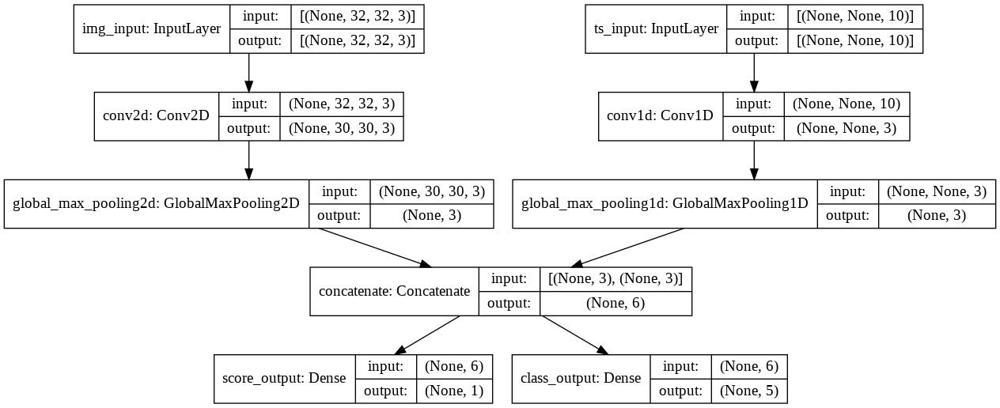

# 使用TensorFlow Keras进行训练和评估 (tensorflow2官方教程翻译)

> 最新版本：[http://www.mashangxue123.com/tensorflow/tf2-guide-keras-training_and_evaluation.html](http://www.mashangxue123.com/tensorflow/tf2-guide-keras-training_and_evaluation.html)
> 英文版本：[https://tensorflow.google.cn/alpha/guide/keras/training_and_evaluation](https://tensorflow.google.cn/alpha/guide/keras/training_and_evaluation)
> 翻译建议PR：[https://github.com/mashangxue/tensorflow2-zh/edit/master/r2/guide/keras/training_and_evaluation.md](https://github.com/mashangxue/tensorflow2-zh/edit/master/r2/guide/keras/training_and_evaluation.md)

本指南涵盖了TensorFlow 2.0在两种主要情况下的训练、评估和预测(推理)模型:

- 使用内置API进行训练和验证时（例如`model.fit()`, `model.evaluate()`, `model.predict()` ）。这将在“使用内置的训练和评估循环”一节中讨论。
- 使用eager execution和 `GradientTape` 对象从头开始编写自定义循环时。这在 “从零开始编写您自己的训练和评估循环” 小节中有介绍。

一般来说，无论您是使用内置循环还是编写自己的循环，模型训练和评估在每种Keras模型(Sequential顺序模型、使用使用函数式API构建的模型以及通过模型子类从零开始编写的模型)中都严格按照相同的方式工作。

本指南不包括分布式训练。

## 设置

安装
```
pip install pydot
apt-get install graphviz
pip install tensorflow-gpu==2.0.0-alpha0
```

导入
```
from __future__ import absolute_import, division, print_function, unicode_literals

import tensorflow as tf

tf.keras.backend.clear_session()  # For easy reset of notebook state.
```

## 第一部分：使用内置训练和评估循环

When passing data to the built-in training loops of a model, you should either use **Numpy arrays** (if your data is small and fits in memory) or **tf.data Dataset** objects. In the next few paragraphs, we'll use the MNIST dataset as Numpy arrays, in order to demonstrate how to use optimizers, losses, and metrics.

将数据传递给模型的内置训练循环时，您应该使用Numpy数组（如果数据很小并且适合内存）或tf.data数据集对象。在接下来的几段中，我们将使用MNIST数据集作为Numpy数组，以演示如何使用优化器，损失和指标。

### API概述：第一个端到端示例

Let's consider the following model (here, we build in with the Functional API, but it could be a Sequential model or a subclassed model as well):

让我们考虑以下模型（这里，我们使用Functional API构建，但它也可以是顺序模型或子类模型）：


```
from tensorflow import keras
from tensorflow.keras import layers

inputs = keras.Input(shape=(784,), name='digits')
x = layers.Dense(64, activation='relu', name='dense_1')(inputs)
x = layers.Dense(64, activation='relu', name='dense_2')(x)
outputs = layers.Dense(10, activation='softmax', name='predictions')(x)

model = keras.Model(inputs=inputs, outputs=outputs)
```

Here's what the typical end-to-end workflow looks like, consisting of training, validation on a holdout set generated from the original training data, and finally evaluation on the test data:
以下是典型的端到端工作流程的外观，包括训练，对原始训练数据生成的保留集的验证，以及最终对测试数据的评估：


```
# Load a toy dataset for the sake of this example
(x_train, y_train), (x_test, y_test) = keras.datasets.mnist.load_data()

# Preprocess the data (these are Numpy arrays)
x_train = x_train.reshape(60000, 784).astype('float32') / 255
x_test = x_test.reshape(10000, 784).astype('float32') / 255

# Reserve 10,000 samples for validation
x_val = x_train[-10000:]
y_val = y_train[-10000:]
x_train = x_train[:-10000]
y_train = y_train[:-10000]

# Specify the training configuration (optimizer, loss, metrics)
model.compile(optimizer=keras.optimizers.RMSprop(),  # Optimizer
              # Loss function to minimize
              loss=keras.losses.SparseCategoricalCrossentropy(),
              # List of metrics to monitor
              metrics=[keras.metrics.SparseCategoricalAccuracy()])

# Train the model by slicing the data into "batches"
# of size "batch_size", and repeatedly iterating over
# the entire dataset for a given number of "epochs"
print('# Fit model on training data')
history = model.fit(x_train, y_train,
                    batch_size=64,
                    epochs=3,
                    # We pass some validation for
                    # monitoring validation loss and metrics
                    # at the end of each epoch
                    validation_data=(x_val, y_val))

# The returned "history" object holds a record
# of the loss values and metric values during training
print('\nhistory dict:', history.history)

# Evaluate the model on the test data using `evaluate`
print('\n# Evaluate on test data')
results = model.evaluate(x_test, y_test, batch_size=128)
print('test loss, test acc:', results)

# Generate predictions (probabilities -- the output of the last layer)
# on new data using `predict`
print('\n# Generate predictions for 3 samples')
predictions = model.predict(x_test[:3])
print('predictions shape:', predictions.shape)
```

    Downloading data from https://storage.googleapis.com/tensorflow/tf-keras-datasets/mnist.npz
    11493376/11490434 [==============================] - 0s 0us/step
    # Fit model on training data
    Train on 50000 samples, validate on 10000 samples
    Epoch 1/3
    50000/50000 [==============================] - 5s 110us/sample - loss: 0.3377 - sparse_categorical_accuracy: 0.9053 - val_loss: 0.2020 - val_sparse_categorical_accuracy: 0.9402
    Epoch 2/3
    50000/50000 [==============================] - 5s 107us/sample - loss: 0.1576 - sparse_categorical_accuracy: 0.9528 - val_loss: 0.1379 - val_sparse_categorical_accuracy: 0.9616
    Epoch 3/3
    50000/50000 [==============================] - 5s 106us/sample - loss: 0.1143 - sparse_categorical_accuracy: 0.9650 - val_loss: 0.1128 - val_sparse_categorical_accuracy: 0.9681
    
    history dict: {'loss': [0.33772996835231783, 0.15758442388363184, 0.11431736122608185], 'sparse_categorical_accuracy': [0.90532, 0.95276, 0.96504], 'val_loss': [0.2019659897595644, 0.13788076196610927, 0.1128087827205658], 'val_sparse_categorical_accuracy': [0.9402, 0.9616, 0.9681]}
    
    # Evaluate on test data
    10000/10000 [==============================] - 0s 36us/sample - loss: 0.1238 - sparse_categorical_accuracy: 0.9606
    test loss, test acc: [0.12378974738866091, 0.9606]
    
    # Generate predictions for 3 samples
    predictions shape: (3, 10)


### 指定损失，指标和优化程序Specifying a loss, metrics, and an optimizer

To train a model with `fit`, you need to specify a loss function, an optimizer, and optionally, some metrics to monitor.

You pass these to the model as arguments to the `compile()` method:

要训练合适的模型，您需要指定一个损失函数，一个优化器，以及可选的一些要监控的指标。

您将这些作为 `compile()` 方法的参数传递给模型：

```
model.compile(optimizer=keras.optimizers.RMSprop(learning_rate=1e-3),
              loss=keras.losses.SparseCategoricalCrossentropy(),
              metrics=[keras.metrics.SparseCategoricalAccuracy()])
```

The `metrics` argument should be a list -- you model can have any number of metrics.

If your model has multiple outputs, you can specify  different losses and metrics for each output,
and you can modulate to contribution of each output to the total loss of the model. You will find more details about this in the section "**Passing data to multi-input, multi-output models**".

Note that in many cases, the loss and metrics are specified via string identifiers, as a shortcut:

`metrics` 参数应该是一个列表（您的模型可以包含任意数量的度量标准）。

如果您的模型有多个输出，您可以为每个输出指定不同的损失和度量，并且您可以调整每个输出对模型总损失的贡献。
您将在“将数据传递到多输入、多输出模型”一节中找到更多关于此的详细信息。

注意，在很多情况下，损失和指标是通过字符串标识符指定的，作为一种快捷方式:


```
model.compile(optimizer=keras.optimizers.RMSprop(learning_rate=1e-3),
              loss='sparse_categorical_crossentropy',
              metrics=['sparse_categorical_accuracy'])
```

For later reuse, let's put our model definition and compile step in functions; we will call them several times across different examples in this guide.
为了以后的重用，我们将模型定义和编译步骤放在函数中;我们将在本指南的不同示例中多次调用它们。

```
def get_uncompiled_model():
  inputs = keras.Input(shape=(784,), name='digits')
  x = layers.Dense(64, activation='relu', name='dense_1')(inputs)
  x = layers.Dense(64, activation='relu', name='dense_2')(x)
  outputs = layers.Dense(10, activation='softmax', name='predictions')(x)
  model = keras.Model(inputs=inputs, outputs=outputs)
  return model

def get_compiled_model():
  model = get_uncompiled_model()
  model.compile(optimizer=keras.optimizers.RMSprop(learning_rate=1e-3),
              loss='sparse_categorical_crossentropy',
              metrics=['sparse_categorical_accuracy'])
  return model
```

#### 许多内置的优化器、损失和指标都是可用的

In general, you won't have to create from scratch your own losses, metrics, or optimizers, because what you need is likely already part of the Keras API:
通常，您不必从头开始创建自己的损失，指标或优化器，因为您需要的可能已经是Keras API的一部分：
Optimizers优化器:
- `SGD()` (with or without momentum)
- `RMSprop()`
- `Adam()`
- etc.

Losses损失:
- `MeanSquaredError()`
- `KLDivergence()`
- `CosineSimilarity()`
- etc.

Metrics指标:
- `AUC()`
- `Precision()`
- `Recall()`
- etc.

#### 编写自定义损失和指标

If you need a metric that isn't part of the API, you can easily create custom metrics by subclassing the `Metric` class. You will need to implement 4 methods:
如果您需要不属于API的指标，则可以通过继承Metric类轻松创建自定义指标。您需要实现4种方法：
- `__init__(self)`,  您将在其中为指标创建状态变量。in which you will create state variables for your metric.
- `update_state(self, y_true, y_pred, sample_weight=None)`, 它使用目标`y_true`和模型预测`y_pred`来更新状态变量。which uses the targets `y_true` and the model predictions `y_pred` to update the state variables.
- `result(self)`, 它使用状态变量来计算最终结果。which uses the state variables to compute the final results.
- `reset_states(self)`, 它重新初始化度量的状态。which reinitializes the state of the metric.

State update and results computation are kept separate (in `update_state()` and `result()`, respectively) because in some cases, results computation might be very expensive, and would only be done periodically.
状态更新和结果计算是分开的（分别在`update_state()` 和 `result()`中）因为在某些情况下，结果计算可能非常昂贵，并且只能定期进行。

Here's a simple example showing how to implement a `CatgoricalTruePositives` metric, that counts how many samples where correctly classified as belonging to a given class:
这是一个简单的例子，展示了如何实现一个 `CatgoricalTruePositives`  指标，它计算了正确分类为属于给定类的样本数量：

```
class CatgoricalTruePositives(keras.metrics.Metric):

    def __init__(self, name='categorical_true_positives', **kwargs):
      super(CatgoricalTruePositives, self).__init__(name=name, **kwargs)
      self.true_positives = self.add_weight(name='tp', initializer='zeros')

    def update_state(self, y_true, y_pred, sample_weight=None):
      y_pred = tf.argmax(y_pred)
      values = tf.equal(tf.cast(y_true, 'int32'), tf.cast(y_pred, 'int32'))
      values = tf.cast(values, 'float32')
      if sample_weight is not None:
        sample_weight = tf.cast(sample_weight, 'float32')
        values = tf.multiply(values, sample_weight)
      self.true_positives.assign_add(tf.reduce_sum(values))

    def result(self):
      return self.true_positives

    def reset_states(self):
      # The state of the metric will be reset at the start of each epoch.
      self.true_positives.assign(0.)


model.compile(optimizer=keras.optimizers.RMSprop(learning_rate=1e-3),
              loss=keras.losses.SparseCategoricalCrossentropy(),
              metrics=[CatgoricalTruePositives()])
model.fit(x_train, y_train,
          batch_size=64,
          epochs=3)

```


    Epoch 1/3
    50000/50000 [==============================] - 4s 76us/sample - loss: 0.0917 - binary_true_positives: 7792.0000
    Epoch 2/3
    50000/50000 [==============================] - 3s 67us/sample - loss: 0.0756 - binary_true_positives: 8026.0000
    Epoch 3/3
    50000/50000 [==============================] - 4s 70us/sample - loss: 0.0647 - binary_true_positives: 8459.0000


    <tensorflow.python.keras.callbacks.History at 0x7f6051f16668>


#### 处理不符合标准签名的损失和指标

The overwhelming majority of losses and metrics can be computed from `y_true` and `y_pred`, where `y_pred` is an output of your model. But not all of them. For instance, a regularization loss may only require the activation of a layer (there are no targets in this case), and this activation may not be a model output.

In such cases, you can call `self.add_loss(loss_value)` from inside the `call` method of a custom layer. Here's a simple example that adds activity regularization (note that activity regularization is built-in in all Keras layers -- this layer is just for the sake of providing a concrete example):

绝大多数损失和指标可以从`y_true`和`y_pred`计算，其中`y_pred`是模型的输出。但不是全部。例如，正则化损失可能仅需要激活层（在这种情况下没有目标），并且该激活可能不是模型输出。

在这种情况下，您可以从自定义图层的`call`方法中调用  `self.add_loss(loss_value)` 。这是一个添加活动正则化的简单示例（请注意，活动正则化是内置于所有Keras层中的 - 此层仅用于提供具体示例）：


```
class ActivityRegularizationLayer(layers.Layer):

  def call(self, inputs):
    self.add_loss(tf.reduce_sum(inputs) * 0.1)
    return inputs  # Pass-through layer.

inputs = keras.Input(shape=(784,), name='digits')
x = layers.Dense(64, activation='relu', name='dense_1')(inputs)

# Insert activity regularization as a layer
x = ActivityRegularizationLayer()(x)

x = layers.Dense(64, activation='relu', name='dense_2')(x)
outputs = layers.Dense(10, activation='softmax', name='predictions')(x)

model = keras.Model(inputs=inputs, outputs=outputs)
model.compile(optimizer=keras.optimizers.RMSprop(learning_rate=1e-3),
              loss='sparse_categorical_crossentropy')

# The displayed loss will be much higher than before
# due to the regularization component.
model.fit(x_train, y_train,
          batch_size=64,
          epochs=1)
```

    50000/50000 [==============================] - 4s 75us/sample - loss: 2.5322


    <tensorflow.python.keras.callbacks.History at 0x7f6051a72e10>


You can do the same for logging metric values:
您可以执行相同的记录度量标准值：

```
class MetricLoggingLayer(layers.Layer):

  def call(self, inputs):
    # The `aggregation` argument defines
    # how to aggregate the per-batch values
    # over each epoch:
    # in this case we simply average them.
    self.add_metric(keras.backend.std(inputs),
                    name='std_of_activation',
                    aggregation='mean')
    return inputs  # Pass-through layer.


inputs = keras.Input(shape=(784,), name='digits')
x = layers.Dense(64, activation='relu', name='dense_1')(inputs)

# Insert std logging as a layer.
x = MetricLoggingLayer()(x)

x = layers.Dense(64, activation='relu', name='dense_2')(x)
outputs = layers.Dense(10, activation='softmax', name='predictions')(x)

model = keras.Model(inputs=inputs, outputs=outputs)
model.compile(optimizer=keras.optimizers.RMSprop(learning_rate=1e-3),
              loss='sparse_categorical_crossentropy')
model.fit(x_train, y_train,
          batch_size=64,
          epochs=1)
```

    50000/50000 [==============================] - 4s 76us/sample - loss: 0.3366 - std_of_activation: 0.9773


    <tensorflow.python.keras.callbacks.History at 0x7f6051543e48>


In the [Functional API](functional.ipynb), you can also call `model.add_loss(loss_tensor)`, or `model.add_metric(metric_tensor, name, aggregation)`.

Here's a simple example:

在 [Functional API](https://tensorflow.google.cn/alpha/guide/keras/functional) 中，您还可以调用 `model.add_loss(loss_tensor)`, 或 `model.add_metric(metric_tensor, name, aggregation)`。

这是一个简单的例子：

```
inputs = keras.Input(shape=(784,), name='digits')
x1 = layers.Dense(64, activation='relu', name='dense_1')(inputs)
x2 = layers.Dense(64, activation='relu', name='dense_2')(x1)
outputs = layers.Dense(10, activation='softmax', name='predictions')(x2)
model = keras.Model(inputs=inputs, outputs=outputs)

model.add_loss(tf.reduce_sum(x1) * 0.1)

model.add_metric(keras.backend.std(x1),
                 name='std_of_activation',
                 aggregation='mean')

model.compile(optimizer=keras.optimizers.RMSprop(1e-3),
              loss='sparse_categorical_crossentropy')
model.fit(x_train, y_train,
          batch_size=64,
          epochs=1)
```

    50000/50000 [==============================] - 4s 80us/sample - loss: 2.5158 - std_of_activation: 0.0020


    <tensorflow.python.keras.callbacks.History at 0x7f605103ad30>


#### 自动设置验证保持集Automatically setting apart a validation holdout set

In the first end-to-end example you saw, we used the `validation_data` argument to pass a tuple
of Numpy arrays `(x_val, y_val)` to the model for evaluating a validation loss and validation metrics at the end of each epoch.
在您看到的第一个端到端示例中，我们使用 `validation_data` 参数将Numpy数组  `(x_val, y_val)` 的元组传递给模型，以便在每个时期结束时评估验证损失和验证指标。

Here's another option: the argument `validation_split` allows you to automatically reserve part of your training data for validation. The argument value represents the fraction of the data to be reserved for validation, so it should be set to a number higher than 0 and lower than 1. For instance, `validation_split=0.2` means "use 20% of the data for validation", and `validation_split=0.6` means "use 60% of the data for validation".
这是另一个选项：参数 `validation_split` 允许您自动保留部分训练数据以进行验证。参数值表示要为验证保留的数据的分数，因此应将其设置为大于0且小于1的数字。例如，`validation_split=0.2`  表示“使用20％的数据进行验证”，`validation_split=0.6` 表示“使用60％的数据进行验证”。

The way the validation is computed is by *taking the last x% samples of the arrays received by the `fit` call, before any shuffling*.
计算验证的方法是：在任何混洗之前，通过`fit`调用接收的数组的最后x％样本。
You can only use `validation_split` when training with Numpy data.
在使用Numpy数据进行训练时，您只能使用 `validation_split`。

```
model = get_compiled_model()
model.fit(x_train, y_train, batch_size=64, validation_split=0.2, epochs=3)
```

    Train on 40000 samples, validate on 10000 samples
    Epoch 1/3
    40000/40000 [==============================] - 3s 82us/sample - loss: 0.3735 - sparse_categorical_accuracy: 0.8951 - val_loss: 0.2413 - val_sparse_categorical_accuracy: 0.9272
    Epoch 2/3
    40000/40000 [==============================] - 3s 82us/sample - loss: 0.1688 - sparse_categorical_accuracy: 0.9499 - val_loss: 0.1781 - val_sparse_categorical_accuracy: 0.9468
    Epoch 3/3
    40000/40000 [==============================] - 3s 79us/sample - loss: 0.1232 - sparse_categorical_accuracy: 0.9638 - val_loss: 0.1518 - val_sparse_categorical_accuracy: 0.9539


    <tensorflow.python.keras.callbacks.History at 0x7f6050904f28>


### 来自tf.data数据集的培训和评估

In the past few paragraphs, you've seen how to handle losses, metrics, and optimizers, and you've seen how to use the `validation_data` and `validation_split` arguments in `fit`, when your data is passed as Numpy arrays.
在过去的几段中，您已经了解了如何处理损失，度量和优化器，并且您已经看到，当您的数据作为Numpy数组传递时，如何在`fit`中使用`validation_data` 和 `validation_split` 参数

Let's now take a look at the case where your data comes in the form of a tf.data Dataset.
现在让我们看一下您的数据以tf.data数据集的形式出现的情况。

The tf.data API is a set of utilities in TensorFlow 2.0 for loading and preprocessing data in a way that's fast and scalable.
tf.data API是TensorFlow 2.0中的一组实用程序，用于以快速和可伸缩的方式加载和预处理数据。

For a complete guide about creating Datasets, see [the tf.data documentation](https://tensorflow.google.cn/versions/r2.0/api_docs/python/tf).
有关创建数据集的完整指南，请参阅[the tf.data 文档](https://tensorflow.google.cn/versions/r2.0/api_docs/python/tf)。

You can pass a Dataset instance directly to the methods `fit()`, `evaluate()`, and `predict()`:
您可以将数据集实例直接传递给方法 `fit()`, `evaluate()`, 和 `predict()`：

```
model = get_compiled_model()

# First, let's create a training Dataset instance.
# For the sake of our example, we'll use the same MNIST data as before.
train_dataset = tf.data.Dataset.from_tensor_slices((x_train, y_train))
# Shuffle and slice the dataset.
train_dataset = train_dataset.shuffle(buffer_size=1024).batch(64)

# Now we get a test dataset.
test_dataset = tf.data.Dataset.from_tensor_slices((x_test, y_test))
test_dataset = test_dataset.batch(64)

# Since the dataset already takes care of batching,
# we don't pass a `batch_size` argument.
model.fit(train_dataset, epochs=3)

# You can also evaluate or predict on a dataset.
print('\n# Evaluate')
model.evaluate(test_dataset)
```

    Epoch 1/3
    782/782 [==============================] - 5s 7ms/step - loss: 0.3250 - sparse_categorical_accuracy: 0.9074
    Epoch 2/3
    782/782 [==============================] - 4s 6ms/step - loss: 0.1484 - sparse_categorical_accuracy: 0.9559
    Epoch 3/3
    782/782 [==============================] - 4s 5ms/step - loss: 0.1074 - sparse_categorical_accuracy: 0.9685
    
    # Evaluate
    157/157 [==============================] - 1s 3ms/step - loss: 0.1137 - sparse_categorical_accuracy: 0.9665


    [0.11368312350931062, 0.9665]


Note that the Dataset is reset at the end of each epoch, so it can be reused of the next epoch.

If you want to run training only on a specific number of batches from this Dataset, you can pass the `steps_per_epoch` argument, which specifies how many training steps the model should run using this Dataset before moving on to the next epoch.

If you do this, the dataset is not reset at the end of each epoch, instead we just keep drawing the next batches. The dataset will eventually run out of data (unless it is an infinitely-looping dataset).

请注意，数据集在每个周期的末尾都会重置，因此可以重复使用下一个周期。

如果您只想从此数据集中对特定数量的批次运行训练，则可以传递 `steps_per_epoch`  参数，该参数指定在继续下一个周期之前使用此数据集运行模型的训练步数。

如果这样做，数据集不会在每个周期的末尾重置，而是我们只是继续绘制下一批。数据集最终会耗尽数据（除非它是一个无限循环的数据集）。

```
model = get_compiled_model()

# Prepare the training dataset
train_dataset = tf.data.Dataset.from_tensor_slices((x_train, y_train))
train_dataset = train_dataset.shuffle(buffer_size=1024).batch(64)

# Only use the 100 batches per epoch (that's 64 * 100 samples)
model.fit(train_dataset.take(100), epochs=3)
```

    Epoch 1/3
    100/100 [==============================] - 1s 11ms/step - loss: 0.7733 - sparse_categorical_accuracy: 0.8067
    Epoch 2/3
    100/100 [==============================] - 0s 5ms/step - loss: 0.3706 - sparse_categorical_accuracy: 0.8922
    Epoch 3/3
    100/100 [==============================] - 1s 5ms/step - loss: 0.3379 - sparse_categorical_accuracy: 0.9011


    <tensorflow.python.keras.callbacks.History at 0x7f60504173c8>


#### 使用验证数据集

You can pass a Dataset instance as the `validation_data` argument in `fit`:
您可以将数据集实例作为`fit`中的`validation_data`参数传递：

```
model = get_compiled_model()

# Prepare the training dataset
train_dataset = tf.data.Dataset.from_tensor_slices((x_train, y_train))
train_dataset = train_dataset.shuffle(buffer_size=1024).batch(64)

# Prepare the validation dataset
val_dataset = tf.data.Dataset.from_tensor_slices((x_val, y_val))
val_dataset = val_dataset.batch(64)

model.fit(train_dataset, epochs=3, validation_data=val_dataset)
```

    Epoch 1/3
    782/782 [==============================] - 7s 8ms/step - loss: 0.3440 - sparse_categorical_accuracy: 0.9020 - val_loss: 0.1838 - val_sparse_categorical_accuracy: 0.9490
    Epoch 2/3
    782/782 [==============================] - 7s 9ms/step - loss: 0.1649 - sparse_categorical_accuracy: 0.9515 - val_loss: 0.1391 - val_sparse_categorical_accuracy: 0.9603
    Epoch 3/3
    782/782 [==============================] - 8s 10ms/step - loss: 0.1216 - sparse_categorical_accuracy: 0.9645 - val_loss: 0.1208 - val_sparse_categorical_accuracy: 0.9672


    <tensorflow.python.keras.callbacks.History at 0x7f6050417908>


At the end of each epoch, the model will iterate over the validation Dataset and compute the validation loss and validation metrics.

If you want to run validation only on a specific number of batches from this Dataset, you can pass the `validation_steps` argument, which specifies how many validation steps the model should run with the validation Dataset before interrupting validation and moving on to the next epoch:

在每个周期结束时，模型将迭代验证数据集并计算验证损失和验证指标。

如果你想只在这个数据集中特定数量的批次上运行验证，你可以传递“validation_steps”参数，它指定了模型在中断验证并进入下一个周期之前，应该与验证数据集一起运行多少个验证步骤:

```
model = get_compiled_model()

# Prepare the training dataset
train_dataset = tf.data.Dataset.from_tensor_slices((x_train, y_train))
train_dataset = train_dataset.shuffle(buffer_size=1024).batch(64)

# Prepare the validation dataset
val_dataset = tf.data.Dataset.from_tensor_slices((x_val, y_val))
val_dataset = val_dataset.batch(64)

model.fit(train_dataset, epochs=3,
          # Only run validation using the first 10 batches of the dataset
          # using the `validation_steps` argument
          validation_data=val_dataset, validation_steps=10)
```

    Epoch 1/3
    782/782 [==============================] - 9s 12ms/step - loss: 0.3359 - sparse_categorical_accuracy: 0.9053 - val_loss: 0.3095 - val_sparse_categorical_accuracy: 0.9187
    Epoch 2/3
    782/782 [==============================] - 7s 9ms/step - loss: 0.1593 - sparse_categorical_accuracy: 0.9528 - val_loss: 0.2196 - val_sparse_categorical_accuracy: 0.9438
    Epoch 3/3
    782/782 [==============================] - 7s 9ms/step - loss: 0.1158 - sparse_categorical_accuracy: 0.9661 - val_loss: 0.1840 - val_sparse_categorical_accuracy: 0.9469


    <tensorflow.python.keras.callbacks.History at 0x7f604fe7da90>


Note that the validation Dataset will be reset after each use (so that you will always be evaluating on the same samples from epoch to epoch).

The argument `validation_split` (generating a holdout set from the training data) is not supported when training from Dataset objects, since this features requires the ability to index the samples of the datasets, which is not possible in general with the Dataset API.

请注意，验证数据集将在每次使用后重置（这样您将始终评估从epoch到epoch的相同样本）。从数据集对象进行训练时，不支持参数validation_split（从训练数据生成保持集），因为此功能需要能够索引数据集的样本，这通常是数据集API无法实现的。

### 支持其他输入格式Other input formats supported

Besides Numpy arrays and TensorFlow Datasets, it's possible to train a Keras model using Pandas dataframes, or from Python generators that yield batches.

In general, we recommend that you use Numpy input data if your data is small and fits in memory, and Datasets otherwise.

除了Numpy数组和TensorFlow数据集之外，还可以使用Pandas数据帧或产生批量的Python生成器来训练Keras模型。

通常，如果数据很小并且适合内存，我们建议您使用Numpy输入数据，否则使用数据集。

### 使用样本加权和类权重

Besides input data and target data, it is possible to pass sample weights or class weights to a model when using `fit`:
除了输入数据和目标数据之外，还可以在使用 `fit` 时将样本权重或类权重传递给模型：

- 从Numpy数据训练时：通过`sample_weight`和`class_weight`参数。 
- 从数据集训练时：通过让数据集返回一个元组  `(input_batch, target_batch, sample_weight_batch)` .

A "sample weights" array is an array of numbers that specify how much weight each sample in a batch should have in computing the total loss. It is commonly used in imbalanced classification problems (the idea being to give more weight to rarely-seen classes). When the weights used are ones and zeros, the array can be used as a *mask* for the loss function (entirely discarding the contribution of certain samples to the total loss).

"sample weights" 数组是一个数字数组，用于指定批处理中每个样本在计算总损失时应具有多少权重。它通常用于不平衡的分类问题（这个想法是为了给予很少见的类别更多的权重）。当使用的权重是1和0时，该数组可以用作损失函数的掩码（完全丢弃某些样本对总损失的贡献）。

A "class weights" dict is a more specific instance of the same concept: it maps class indices to the sample weight that should be used for samples belonging to this class. For instance, if class "0" is twice less represented than class "1" in your data, you could use `class_weight={0: 1., 1: 0.5}`.

"class weights" 字典是同一概念的更具体的实例：它将类索引映射到应该用于属于该类的样本的样本权重。例如，如果类“0”比数据中的类“1”少两倍，则可以使用 `class_weight={0: 1., 1: 0.5}`.

Here's a Numpy example where we use class weights or sample weights to give more importance to the correct classification of class #5 (which is the digit "5" in the MNIST dataset).

这是一个Numpy示例，我们使用类权重class weights或样本权重sample weights来更加重视 class #5 的正确分类（这是MNIST数据集中的数字“5”）。

```
import numpy as np

class_weight = {0: 1., 1: 1., 2: 1., 3: 1., 4: 1.,
                # Set weight "2" for class "5",
                # making this class 2x more important
                5: 2.,
                6: 1., 7: 1., 8: 1., 9: 1.}
model.fit(x_train, y_train,
          class_weight=class_weight,
          batch_size=64,
          epochs=4)

# Here's the same example using `sample_weight` instead:
sample_weight = np.ones(shape=(len(y_train),))
sample_weight[y_train == 5] = 2.

model = get_compiled_model()
model.fit(x_train, y_train,
          sample_weight=sample_weight,
          batch_size=64,
          epochs=4)
```

    Epoch 1/4
    50000/50000 [==============================] - 4s 89us/sample - loss: 0.1040 - sparse_categorical_accuracy: 0.9715
    Epoch 2/4
    50000/50000 [==============================] - 4s 83us/sample - loss: 0.0872 - sparse_categorical_accuracy: 0.9751
    Epoch 3/4
    50000/50000 [==============================] - 4s 85us/sample - loss: 0.0734 - sparse_categorical_accuracy: 0.9789
    Epoch 4/4
    50000/50000 [==============================] - 4s 81us/sample - loss: 0.0657 - sparse_categorical_accuracy: 0.9818
    Epoch 1/4
    50000/50000 [==============================] - 4s 87us/sample - loss: 0.3647 - sparse_categorical_accuracy: 0.9063
    Epoch 2/4
    50000/50000 [==============================] - 5s 91us/sample - loss: 0.1703 - sparse_categorical_accuracy: 0.9525
    Epoch 3/4
    50000/50000 [==============================] - 4s 81us/sample - loss: 0.1276 - sparse_categorical_accuracy: 0.9647
    Epoch 4/4
    50000/50000 [==============================] - 4s 83us/sample - loss: 0.1016 - sparse_categorical_accuracy: 0.9719


    <tensorflow.python.keras.callbacks.History at 0x7f604e5e2f98>


Here's a matching Dataset example:
这是一个匹配的数据集示例：

```
sample_weight = np.ones(shape=(len(y_train),))
sample_weight[y_train == 5] = 2.

# Create a Dataset that includes sample weights
# (3rd element in the return tuple).
train_dataset = tf.data.Dataset.from_tensor_slices(
    (x_train, y_train, sample_weight))

# Shuffle and slice the dataset.
train_dataset = train_dataset.shuffle(buffer_size=1024).batch(64)

model = get_compiled_model()
model.fit(train_dataset, epochs=3)
```

    Epoch 1/3
    782/782 [==============================] - 9s 11ms/step - loss: 0.3666 - sparse_categorical_accuracy: 0.9046
    Epoch 2/3
    782/782 [==============================] - 7s 9ms/step - loss: 0.1646 - sparse_categorical_accuracy: 0.9539
    Epoch 3/3
    782/782 [==============================] - 7s 9ms/step - loss: 0.1178 - sparse_categorical_accuracy: 0.9677


    <tensorflow.python.keras.callbacks.History at 0x7f604edb7208>


### 将数据传递到多输入，多输出模型 Passing data to multi-input, multi-output models

In the previous examples, we were considering a model with a single input (a tensor of shape `(764,)`) and a single output (a prediction tensor of shape `(10,)`). But what about models that have multiple inputs or outputs?
在前面的例子中，我们考虑的是一个带有单个输入的模型（形状为 `(764,)` 的张量）和单个输出（形状为 `(10,)` 的预测张量）。但是具有多个输入或输出的模型呢？
Consider the following model, which has an image input of shape `(32, 32, 3)` (that's `(height, width, channels)`) and a timeseries input of shape `(None, 10)` (that's `(timesteps, features)`). Our model will have two outputs computed from the combination of these inputs: a "score" (of shape `(1,)`) and a probability distribution over 5 classes (of shape `(10,)`).
考虑下面的模型，它有一个形状为 `(32, 32, 3)`  的形状输入（即“（高度，宽度，通道）”）和形状为 `(None, 10)` 的时间序列输入（即“（时间步长，特征）”）。我们的模型将根据这些输入的组合计算两个输出：“得分”（形状为`(1,)`和5个类别（形状为`(10,)`）的概率分布。


```
from tensorflow import keras
from tensorflow.keras import layers

image_input = keras.Input(shape=(32, 32, 3), name='img_input')
timeseries_input = keras.Input(shape=(None, 10), name='ts_input')

x1 = layers.Conv2D(3, 3)(image_input)
x1 = layers.GlobalMaxPooling2D()(x1)

x2 = layers.Conv1D(3, 3)(timeseries_input)
x2 = layers.GlobalMaxPooling1D()(x2)

x = layers.concatenate([x1, x2])

score_output = layers.Dense(1, name='score_output')(x)
class_output = layers.Dense(5, activation='softmax', name='class_output')(x)

model = keras.Model(inputs=[image_input, timeseries_input],
                    outputs=[score_output, class_output])
```

Let's plot this model, so you can clearly see what we're doing here (note that the shapes shown in the plot are batch shapes, rather than per-sample shapes).
让我们绘制这个模型，这样你就可以清楚地看到我们在这里做的事情（请注意，图中显示的形状是批量形状，而不是每个样本的形状）。

```
keras.utils.plot_model(model, 'multi_input_and_output_model.png', show_shapes=True)
```





At compilation time, we can specify different losses to different ouptuts, by passing the loss functions as a list:
在编译时，我们可以通过将损失函数作为列表传递给不同的输出指定不同的损失：

```
model.compile(
    optimizer=keras.optimizers.RMSprop(1e-3),
    loss=[keras.losses.MeanSquaredError(),
          keras.losses.CategoricalCrossentropy()])
```

If we only passed a single loss function to the model, the same loss function would be applied to every output, which is not appropriate here.
如果我们只将单个损失函数传递给模型，则相同的损失函数将应用于每个输出，这在这里是不合适的。

Likewise for metrics:
同样适用于指标：

```
model.compile(
    optimizer=keras.optimizers.RMSprop(1e-3),
    loss=[keras.losses.MeanSquaredError(),
          keras.losses.CategoricalCrossentropy()],
    metrics=[[keras.metrics.MeanAbsolutePercentageError(),
              keras.metrics.MeanAbsoluteError()],
             [keras.metrics.CategoricalAccuracy()]])
```

Since we gave names to our output layers, we coud also specify per-output losses and metrics via a dict:
由于我们为输出层指定了名称，因此我们还可以通过dict指定每个输出的损失和指标：

```
model.compile(
    optimizer=keras.optimizers.RMSprop(1e-3),
    loss={'score_output': keras.losses.MeanSquaredError(),
          'class_output': keras.losses.CategoricalCrossentropy()},
    metrics={'score_output': [keras.metrics.MeanAbsolutePercentageError(),
                              keras.metrics.MeanAbsoluteError()],
             'class_output': [keras.metrics.CategoricalAccuracy()]})
```

We recommend the use of explicit names and dicts if you have more than 2 outputs.
如果您有超过2个输出，我们建议使用显式名称和dicts。
It's possible to give different weights to different output-specific losses (for instance, one might wish to privilege the "score" loss in our example, by giving to 2x the importance of the class loss), using the `loss_weight` argument:
可以给不同的输出特定损失赋予不同的权重（例如，可能希望通过使用`loss_weight`参数赋予2x类损失的重要性来保留我们示例中的“得分”损失特权：

```
model.compile(
    optimizer=keras.optimizers.RMSprop(1e-3),
    loss={'score_output': keras.losses.MeanSquaredError(),
          'class_output': keras.losses.CategoricalCrossentropy()},
    metrics={'score_output': [keras.metrics.MeanAbsolutePercentageError(),
                              keras.metrics.MeanAbsoluteError()],
             'class_output': [keras.metrics.CategoricalAccuracy()]},
    loss_weight={'score_output': 2., 'class_output': 1.})
```

You could also chose not to compute a loss for certain outputs, if these outputs meant for prediction but not for training:
您还可以选择不计算某些输出的损失，如果这些输出用于预测但不用于训练：

```
# List loss version
model.compile(
    optimizer=keras.optimizers.RMSprop(1e-3),
    loss=[None, keras.losses.CategoricalCrossentropy()])

# Or dict loss version
model.compile(
    optimizer=keras.optimizers.RMSprop(1e-3),
    loss={'class_output': keras.losses.CategoricalCrossentropy()})
```

    WARNING: Logging before flag parsing goes to stderr.
    W0305 23:50:32.918388 140053718652800 training_utils.py:1152] Output score_output missing from loss dictionary. We assume this was done on purpose. The fit and evaluate APIs will not be expecting any data to be passed to score_output.


Passing data to a multi-input or multi-output model in `fit` works in a similar way as specifying a loss function in `compile`:
将数据传递给`fit`中的多输入或多输出模型的工作方式与在`compile`中指定损失函数的方式类似：
you can pass *lists of Numpy arrays (with 1:1 mapping to the outputs that received a loss function)* or *dicts mapping output names to Numpy arrays of training data*.
你可以传递Numpy数组列表（1：1映射到接收到损失函数的输出）或者将输出名称映射到Numpy训练数据数组。

```
model.compile(
    optimizer=keras.optimizers.RMSprop(1e-3),
    loss=[keras.losses.MeanSquaredError(),
          keras.losses.CategoricalCrossentropy()])

# Generate dummy Numpy data
img_data = np.random.random_sample(size=(100, 32, 32, 3))
ts_data = np.random.random_sample(size=(100, 20, 10))
score_targets = np.random.random_sample(size=(100, 1))
class_targets = np.random.random_sample(size=(100, 5))

# Fit on lists
model.fit([img_data, ts_data], [score_targets, class_targets],
          batch_size=32,
          epochs=3)

# Alernatively, fit on dicts
model.fit({'img_input': img_data, 'ts_input': ts_data},
          {'score_output': score_targets, 'class_output': class_targets},
          batch_size=32,
          epochs=3)
```

    Epoch 1/3
    100/100 [==============================] - 1s 6ms/sample - loss: 7.6847 - score_output_loss: 0.7406 - class_output_loss: 6.9441
    Epoch 2/3
    100/100 [==============================] - 0s 1ms/sample - loss: 7.0638 - score_output_loss: 0.3140 - class_output_loss: 6.7499
    Epoch 3/3
    100/100 [==============================] - 0s 1ms/sample - loss: 6.7368 - score_output_loss: 0.1928 - class_output_loss: 6.5440
    Epoch 1/3
    100/100 [==============================] - 0s 4ms/sample - loss: 6.4485 - score_output_loss: 0.1420 - class_output_loss: 6.3065
    Epoch 2/3
    100/100 [==============================] - 0s 4ms/sample - loss: 6.1095 - score_output_loss: 0.1428 - class_output_loss: 5.9667
    Epoch 3/3
    100/100 [==============================] - 0s 4ms/sample - loss: 5.8362 - score_output_loss: 0.1219 - class_output_loss: 5.7143


    <tensorflow.python.keras.callbacks.History at 0x7f6051289128>


Here's the Dataset use case: similarly as what we did for Numpy arrays, the Dataset should return
a tuple of dicts.
这是数据集用例：类似于我们为Numpy数组所做的，数据集应该返回一个dicts元组。

```
train_dataset = tf.data.Dataset.from_tensor_slices(
    ({'img_input': img_data, 'ts_input': ts_data},
     {'score_output': score_targets, 'class_output': class_targets}))
train_dataset = train_dataset.shuffle(buffer_size=1024).batch(64)

model.fit(train_dataset, epochs=3)
```

    Epoch 1/3
    2/2 [==============================] - 0s 152ms/step - loss: 5.6598 - score_output_loss: 0.1304 - class_output_loss: 5.5127
    Epoch 2/3
    2/2 [==============================] - 0s 107ms/step - loss: 5.5597 - score_output_loss: 0.1229 - class_output_loss: 5.4204
    Epoch 3/3
    2/2 [==============================] - 0s 145ms/step - loss: 5.4660 - score_output_loss: 0.1176 - class_output_loss: 5.3324


    <tensorflow.python.keras.callbacks.History at 0x7f6050417fd0>


### 使用回调Using callbacks

Callbacks in Keras are objects that are called at different point during training (at the start of an epoch, at the end of a batch, at the end of an epoch, etc.) and which can be used to implement behaviors such as:

Keras中的回调是在训练期间（在周期开始时，批处理结束时，周期结束时等）在不同点调用的对象，可用于实现以下行为：
- 在训练期间的不同时间点进行验证（超出内置的每个时期验证）Doing validation at different points during training (beyond the built-in per-epoch validation)
- 定期检查模型或超过某个精度阈值Checkpointing the model at regular intervals or when it exceeds a certain accuracy threshold
- 在训练时改变模型的学习率似乎是平稳的 Changing the learning rate of the model when training seems to be plateauing
- 在训练时对顶层进行微调似乎是平稳的Doing fine-tuning of the top layers when training seems to be plateauing
- 在训练结束或超出某个性能阈值时发送电子邮件或即时消息通知Sending email or instant message notifications when training ends or where a certain performance threshold is exceeded
- Etc.

Callbacks can be passed as a list to your call to `fit`:
回调可以作为列表传递给你对 `fit` 的调用：

```
model = get_compiled_model()

callbacks = [
    keras.callbacks.EarlyStopping(
        # Stop training when `val_loss` is no longer improving
        monitor='val_loss',
        # "no longer improving" being defined as "no better than 1e-2 less"
        min_delta=1e-2,
        # "no longer improving" being further defined as "for at least 2 epochs"
        patience=2,
        verbose=1)
]
model.fit(x_train, y_train,
          epochs=20,
          batch_size=64,
          callbacks=callbacks,
          validation_split=0.2)
```

    Train on 40000 samples, validate on 10000 samples
    Epoch 1/20
    40000/40000 [==============================] - 4s 102us/sample - loss: 0.3712 - sparse_categorical_accuracy: 0.8955 - val_loss: 0.2237 - val_sparse_categorical_accuracy: 0.9325
    Epoch 2/20
    40000/40000 [==============================] - 4s 93us/sample - loss: 0.1754 - sparse_categorical_accuracy: 0.9483 - val_loss: 0.1784 - val_sparse_categorical_accuracy: 0.9440
    Epoch 3/20
    40000/40000 [==============================] - 3s 84us/sample - loss: 0.1255 - sparse_categorical_accuracy: 0.9619 - val_loss: 0.1583 - val_sparse_categorical_accuracy: 0.9514
    Epoch 4/20
    40000/40000 [==============================] - 4s 90us/sample - loss: 0.1003 - sparse_categorical_accuracy: 0.9703 - val_loss: 0.1404 - val_sparse_categorical_accuracy: 0.9587
    Epoch 5/20
    40000/40000 [==============================] - 4s 88us/sample - loss: 0.0829 - sparse_categorical_accuracy: 0.9757 - val_loss: 0.1332 - val_sparse_categorical_accuracy: 0.9617
    Epoch 6/20
    40000/40000 [==============================] - 4s 97us/sample - loss: 0.0705 - sparse_categorical_accuracy: 0.9789 - val_loss: 0.1341 - val_sparse_categorical_accuracy: 0.9641
    Epoch 00006: early stopping


    <tensorflow.python.keras.callbacks.History at 0x7f604c45ff60>


#### 许多内置回调都可用 Many built-in callbacks are available

- `ModelCheckpoint`: 定期保存模型。
- `EarlyStopping`: 当训练不再改进验证指标时停止训练。Stop training when training is no longer improving the validation metrics.
- `TensorBoard`: 定期编写可在TensorBoard中显示的模型日志（更多细节见“可视化”）。
- `CSVLogger`: 将丢失和指标数据丢失到CSV文件。streams loss and metrics data to a CSV file.
- etc.


#### 编写自己的回调

You can create a custom callback by extending the base class keras.callbacks.Callback. A callback has access to its associated model through the class property `self.model`.
您可以通过扩展基类 `keras.callbacks.Callback` 来创建自定义回调。回调可以通过类属性 `self.model` 访问其关联的模型。
Here's a simple example saving a list of per-batch loss values during training:
以下是在训练期间保存每批损失值列表的简单示例：

```python
class LossHistory(keras.callbacks.Callback):

    def on_train_begin(self, logs):
        self.losses = []

    def on_batch_end(self, batch, logs):
        self.losses.append(logs.get('loss'))
```

### 检查点模型

When you're training model on relatively large datasets, it's crucial to save checkpoints of your model at frequent intervals.
当您在相对较大的数据集上训练模型时，以频繁的间隔保存模型的检查点至关重要。
The easiest way to achieve this is with the `ModelCheckpoint` callback:
实现此目的的最简单方法是使用 `ModelCheckpoint` 回调：

```
model = get_compiled_model()

callbacks = [
    keras.callbacks.ModelCheckpoint(
        filepath='mymodel_{epoch}.h5',
        # Path where to save the model
        # The two parameters below mean that we will overwrite
        # the current checkpoint if and only if
        # the `val_loss` score has improved.
        save_best_only=True,
        monitor='val_loss',
        verbose=1)
]
model.fit(x_train, y_train,
          epochs=3,
          batch_size=64,
          callbacks=callbacks,
          validation_split=0.2)
```

    Train on 40000 samples, validate on 10000 samples
    Epoch 1/3
    39936/40000 [============================>.] - ETA: 0s - loss: 0.3635 - sparse_categorical_accuracy: 0.8971
    Epoch 00001: val_loss improved from inf to 0.21655, saving model to mymodel_1.h5
    40000/40000 [==============================] - 4s 108us/sample - loss: 0.3631 - sparse_categorical_accuracy: 0.8972 - val_loss: 0.2166 - val_sparse_categorical_accuracy: 0.9347
    Epoch 2/3
    39360/40000 [============================>.] - ETA: 0s - loss: 0.1669 - sparse_categorical_accuracy: 0.9506
    Epoch 00002: val_loss improved from 0.21655 to 0.17676, saving model to mymodel_2.h5
    40000/40000 [==============================] - 4s 97us/sample - loss: 0.1669 - sparse_categorical_accuracy: 0.9505 - val_loss: 0.1768 - val_sparse_categorical_accuracy: 0.9456
    Epoch 3/3
    39424/40000 [============================>.] - ETA: 0s - loss: 0.1232 - sparse_categorical_accuracy: 0.9624
    Epoch 00003: val_loss improved from 0.17676 to 0.15663, saving model to mymodel_3.h5
    40000/40000 [==============================] - 4s 99us/sample - loss: 0.1236 - sparse_categorical_accuracy: 0.9624 - val_loss: 0.1566 - val_sparse_categorical_accuracy: 0.9536


    <tensorflow.python.keras.callbacks.History at 0x7f604bfdfe80>


You call also write your own callback for saving and restoring models.
您也可以编写自己的回调来保存和恢复模型。
For a complete guide on serialization and saving, see [Guide to Saving and Serializing Models](./saving_and_serializing.ipynb).
有关序列化和保存的完整指南，请参见[保存和序列化模型指南](https://tensorflow.google.cn/alpha/guide/keras/saving_and_serializing)。

### 使用学习率计划Using learning rate schedules

A common pattern when training deep learning models is to gradually reduce the learning as training progresses. This is generally known as "learning rate decay".

The learning decay schedule could be static (fixed in advance, as a function of the current epoch or the current batch index), or dynamic (responding to the current behavior of the model, in particular the validation loss).

在训练深度学习模型时，一个常见的模式是随着训练的进展逐步减少学习。这通常被称为“学习速度衰减”。

学习衰减计划可以是静态的(预先固定，作为当前周期或当前批处理索引的函数)，也可以是动态的(响应模型当前的行为，特别是验证损失)。

#### 将计划传递给优化程序 Passing a schedule to an optimizer

You can easily use a static learning rate decay schedule by passing a schedule object as the `learning_rate` argument in your optimizer:
您可以通过在优化程序中将计划对象作为learning_rate参数传递，轻松使用静态学习速率衰减计划：


```
initial_learning_rate = 0.1
lr_schedule = keras.optimizers.schedules.ExponentialDecay(
    initial_learning_rate,
    decay_steps=100000,
    decay_rate=0.96,
    staircase=True)

optimizer = keras.optimizers.RMSprop(learning_rate=lr_schedule)
```

有几个内置的schedule表: `ExponentialDecay`, `PiecewiseConstantDecay`, `PolynomialDecay`, and `InverseTimeDecay`.

#### 使用回调来实现动态学习速率计划 Using callbacks to implement a dynamic learning rate schedule

A dynamic learning rate schedule (for instance, decreasing the learning rate when the validation loss is no longer improving) cannot be achieved with these schedule objects since the optimizer does not have access to validation metrics.

However, callbacks do have access to all metrics, including validation metrics! You can thus achieve this pattern by using a callback that modifies the current learning rate on the optimizer. In fact, this is even built-in as the `ReduceLROnPlateau` callback.


使用这些schedule对象无法实现动态学习速率计划(例如，当验证损失不再改善时降低学习速率)，因为优化器无法访问验证指标。

然而，回调确实可以访问所有指标，包括验证指标!
因此，可以通过使用回调函数来修改优化器上的当前学习率来实现这种模式。
事实上，它甚至内置在 `ReduceLROnPlateau`  回调函数中。

### 在训练期间可视化损失和度量Visualizing loss and metrics during training

The best way to keep an eye on your model during training is to use [TensorBoard](https://www.tensorflow.org/tensorboard), a browser-based application that you can run locally that provides you with:

在训练期间密切关注你的模型的最好方法是使用 [TensorBoard](https://www.tensorflow.org/tensorboard) ，这是一个基于浏览器的应用程序，你可以在本地运行，它为你提供:
- 实时绘制损失和训练和评估指标 Live plots of the loss and metrics for training and evaluation
- （可选）可视化图层激活的直方图 (optionally) Visualizations of the histograms of your layer activations
- （可选）由“嵌入”图层学习的嵌入空间的三维可视化 (optionally) 3D visualizations of the embedding spaces learned by your `Embedding` layers

If you have installed TensorFlow with pip, you should be able to launch TensorBoard from the command line:
如果您已经使用pip安装了TensorFlow，那么您应该能够从命令行启动TensorBoard：
```
tensorboard --logdir=/full_path_to_your_logs
```

#### 使用TensorBoard回调Using the TensorBoard callback

The easiest way to use TensorBoard with a Keras model and the `fit` method is the `TensorBoard` callback.
在Keras模型和 `fit` 方法中使用TensorBoard的最简单方法是TensorBoard回调。

In the simplest case, just specify where you want the callback to write logs, and you're good to go:
在最简单的情况下，只需指定回写日志的位置，就可以了：

```python
tensorboard_cbk = keras.callbacks.TensorBoard(log_dir='/full_path_to_your_logs')
model.fit(dataset, epochs=10, callbacks=[tensorboard_cbk])
```

The `TensorBoard` callback has many useful options, including whether to log embeddings, histograms, and how often to write logs:
TensorBoard回调有许多有用的选项，包括是否记录嵌入，直方图以及写入日志的频率：

```python
keras.callbacks.TensorBoard(
  log_dir='/full_path_to_your_logs',
  histogram_freq=0,  # How often to log histogram visualizations
  embeddings_freq=0,  # How often to log embedding visualizations
  update_freq='epoch')  # How often to write logs (default: once per epoch)
```


## 第二部分：从头开始编写自己的训练和评估循环Part II: Writing your own training & evaluation loops from scratch

If you want lower-level over your training & evaluation loops than what `fit()` and `evaluate()` provide, you should write your own. It's actually pretty simple! But you should be ready to have a lot more debugging to do on your own.
如果你想要训练和评估循环的级别低于 `fit()` 和 `evaluate()` 提供的的级别，你应该自己编写。它实际上非常简单！但是你应该准备好自己做更多的调试。

### 使用GradientTape：第一个端到端的例子 Using the GradientTape: a first end-to-end example

Calling a model inside a `GradientTape` scope enables you to retrieve the gradients of the trainable weights of the layer with respect to a loss value. Using an optimizer instance, you can use these gradients to update these variables (which you can retrieve using `model.trainable_weights`).

在“GradientTape”范围内调用模型使您可以根据损失值检索图层的可训练权重的梯度。使用优化器实例，您可以使用这些梯度来更新这些变量（可以使用`model.trainable_weights`检索）。

Let's reuse our initial MNIST model from Part I, and let's train it using mini-batch gradient with a custom training loop.
让我们重用第一部分中的初始MNIST模型，让我们使用带有自定义训练循环的小批量梯度训练它。

```
# Get the model.
inputs = keras.Input(shape=(784,), name='digits')
x = layers.Dense(64, activation='relu', name='dense_1')(inputs)
x = layers.Dense(64, activation='relu', name='dense_2')(x)
outputs = layers.Dense(10, activation='softmax', name='predictions')(x)
model = keras.Model(inputs=inputs, outputs=outputs)

# Instantiate an optimizer.
optimizer = keras.optimizers.SGD(learning_rate=1e-3)
# Instantiate a loss function.
loss_fn = keras.losses.SparseCategoricalCrossentropy()

# Prepare the training dataset.
batch_size = 64
train_dataset = tf.data.Dataset.from_tensor_slices((x_train, y_train))
train_dataset = train_dataset.shuffle(buffer_size=1024).batch(batch_size)

# Iterate over epochs.
for epoch in range(3):
  print('Start of epoch %d' % (epoch,))

  # Iterate over the batches of the dataset.
  for step, (x_batch_train, y_batch_train) in enumerate(train_dataset):

    # Open a GradientTape to record the operations run
    # during the forward pass, which enables autodifferentiation.
    with tf.GradientTape() as tape:

      # Run the forward pass of the layer.
      # The operations that the layer applies
      # to its inputs are going to be recorded
      # on the GradientTape.
      logits = model(x_batch_train)  # Logits for this minibatch

      # Compute the loss value for this minibatch.
      loss_value = loss_fn(y_batch_train, logits)

    # Use the gradient tape to automatically retrieve
    # the gradients of the trainable variables with respect to the loss.
    grads = tape.gradient(loss_value, model.trainable_weights)

    # Run one step of gradient descent by updating
    # the value of the variables to minimize the loss.
    optimizer.apply_gradients(zip(grads, model.trainable_weights))

    # Log every 200 batches.
    if step % 200 == 0:
        print('Training loss (for one batch) at step %s: %s' % (step, float(loss_value)))
        print('Seen so far: %s samples' % ((step + 1) * 64))
```

    Start of epoch 0
    Training loss (for one batch) at step 0: 2.295337200164795
    Seen so far: 64 samples
    Training loss (for one batch) at step 200: 2.267664909362793
    Seen so far: 12864 samples
    Training loss (for one batch) at step 400: 2.1268270015716553
    Seen so far: 25664 samples
    Training loss (for one batch) at step 600: 2.0609934329986572
    Seen so far: 38464 samples
    Start of epoch 1
    Training loss (for one batch) at step 0: 1.9627395868301392
    Seen so far: 64 samples
    Training loss (for one batch) at step 200: 1.9132888317108154
    Seen so far: 12864 samples
    Training loss (for one batch) at step 400: 1.7715450525283813
    Seen so far: 25664 samples
    Training loss (for one batch) at step 600: 1.680647611618042
    Seen so far: 38464 samples
    Start of epoch 2
    Training loss (for one batch) at step 0: 1.554194450378418
    Seen so far: 64 samples
    Training loss (for one batch) at step 200: 1.5058209896087646
    Seen so far: 12864 samples
    Training loss (for one batch) at step 400: 1.3611259460449219
    Seen so far: 25664 samples
    Training loss (for one batch) at step 600: 1.2863078117370605
    Seen so far: 38464 samples


### 指标的低级处理Low-level handling of metrics

Let's add metrics to the mix. You can readily reuse the built-in metrics (or custom ones you wrote) in such training loops written from scratch. Here's the flow:
让我们添加指标。您可以很容易地在这样的训练循环中重用内置的指标（或您编写的自定义指标）。这是流程：

- 在循环开始时实例化度量标准
- 每批后调用 `metric.update_state()` 
- 当需要显示度量的当前值时，调用`metric.result()`
- 当需要清除度量的状态时（通常在一个周期的末尾），调用`metric.reset_states()`

Let's use this knowledge to compute `SparseCategoricalAccuracy` on validation data at the end of each epoch:
让我们使用这些知识在每个周期结束时计算验证数据的 `SparseCategoricalAccuracy` ：

```
# Get model
inputs = keras.Input(shape=(784,), name='digits')
x = layers.Dense(64, activation='relu', name='dense_1')(inputs)
x = layers.Dense(64, activation='relu', name='dense_2')(x)
outputs = layers.Dense(10, activation='softmax', name='predictions')(x)
model = keras.Model(inputs=inputs, outputs=outputs)

# Instantiate an optimizer to train the model.
optimizer = keras.optimizers.SGD(learning_rate=1e-3)
# Instantiate a loss function.
loss_fn = keras.losses.SparseCategoricalCrossentropy()

# Prepare the metrics.
train_acc_metric = keras.metrics.SparseCategoricalAccuracy()
val_acc_metric = keras.metrics.SparseCategoricalAccuracy()

# Prepare the training dataset.
batch_size = 64
train_dataset = tf.data.Dataset.from_tensor_slices((x_train, y_train))
train_dataset = train_dataset.shuffle(buffer_size=1024).batch(batch_size)

# Prepare the validation dataset.
val_dataset = tf.data.Dataset.from_tensor_slices((x_val, y_val))
val_dataset = val_dataset.batch(64)


# Iterate over epochs.
for epoch in range(3):
  print('Start of epoch %d' % (epoch,))

  # Iterate over the batches of the dataset.
  for step, (x_batch_train, y_batch_train) in enumerate(train_dataset):
    with tf.GradientTape() as tape:
      logits = model(x_batch_train)
      loss_value = loss_fn(y_batch_train, logits)
    grads = tape.gradient(loss_value, model.trainable_weights)
    optimizer.apply_gradients(zip(grads, model.trainable_weights))

    # Update training metric.
    train_acc_metric(y_batch_train, logits)

    # Log every 200 batches.
    if step % 200 == 0:
        print('Training loss (for one batch) at step %s: %s' % (step, float(loss_value)))
        print('Seen so far: %s samples' % ((step + 1) * 64))

  # Display metrics at the end of each epoch.
  train_acc = train_acc_metric.result()
  print('Training acc over epoch: %s' % (float(train_acc),))
  # Reset training metrics at the end of each epoch
  train_acc_metric.reset_states()

  # Run a validation loop at the end of each epoch.
  for x_batch_val, y_batch_val in val_dataset:
    val_logits = model(x_batch_val)
    # Update val metrics
    val_acc_metric(y_batch_val, val_logits)
  val_acc = val_acc_metric.result()
  val_acc_metric.reset_states()
  print('Validation acc: %s' % (float(val_acc),))
```

    Start of epoch 0
    Training loss (for one batch) at step 0: 2.3286547660827637
    Seen so far: 64 samples
    Training loss (for one batch) at step 200: 2.297130823135376
    Seen so far: 12864 samples
    Training loss (for one batch) at step 400: 2.168592929840088
    Seen so far: 25664 samples
    Training loss (for one batch) at step 600: 2.037825107574463
    Seen so far: 38464 samples
    Training acc over epoch: 0.2502399981021881
    Validation acc: 0.4449000060558319
    Start of epoch 1
    Training loss (for one batch) at step 0: 1.9728939533233643
    Seen so far: 64 samples
    Training loss (for one batch) at step 200: 1.9893989562988281
    Seen so far: 12864 samples
    Training loss (for one batch) at step 400: 1.7468760013580322
    Seen so far: 25664 samples
    Training loss (for one batch) at step 600: 1.6020689010620117
    Seen so far: 38464 samples
    Training acc over epoch: 0.5704200267791748
    Validation acc: 0.6780999898910522
    Start of epoch 2
    Training loss (for one batch) at step 0: 1.476192831993103
    Seen so far: 64 samples
    Training loss (for one batch) at step 200: 1.558509349822998
    Seen so far: 12864 samples
    Training loss (for one batch) at step 400: 1.267077922821045
    Seen so far: 25664 samples
    Training loss (for one batch) at step 600: 1.1969627141952515
    Seen so far: 38464 samples
    Training acc over epoch: 0.7189000248908997
    Validation acc: 0.7734000086784363


### 低水平处理额外损失Low-level handling of extra losses

You saw in the previous section that it is possible for regularization losses to be added by a layer by calling `self.add_loss(value)` in the `call` method.
您在上一节中看到，通过在`call`方法中调用 `self.add_loss(value)` ，可以通过图层添加正则化损失。

In the general case, you will want to take these losses into account in your custom training loops (unless you've written the model yourself and you already know that it creates no such losses).
在一般情况下，您需要在自定义训练循环中考虑这些损失（除非您自己编写模型并且您已经知道它不会造成这样的损失）。

Recall this example from the previous section, featuring a layer that creates a regularization loss:
回想一下上一节的这个例子，它的特点是一个层会产生正则化损失:

```
class ActivityRegularizationLayer(layers.Layer):

  def call(self, inputs):
    self.add_loss(1e-2 * tf.reduce_sum(inputs))
    return inputs

inputs = keras.Input(shape=(784,), name='digits')
x = layers.Dense(64, activation='relu', name='dense_1')(inputs)
# Insert activity regularization as a layer
x = ActivityRegularizationLayer()(x)
x = layers.Dense(64, activation='relu', name='dense_2')(x)
outputs = layers.Dense(10, activation='softmax', name='predictions')(x)

model = keras.Model(inputs=inputs, outputs=outputs)

```

When you call a model, like this:
当您调用模型时，如下所示：

```python
logits = model(x_train)
```

the losses it creates during the forward pass are added to the `model.losses` attribute:
它在前向传递期间产生的损失被添加到  `model.losses`  属性中：

```
logits = model(x_train[:64])
print(model.losses)
```

    [<tf.Tensor: id=999790, shape=(), dtype=float32, numpy=6.8533154>]


The tracked losses are first cleared at the start of the model `__call__`, so you will only see the losses created during this one forward pass. For instance, calling the model repeatedly and then querying `losses` only displays the latest losses, created during the last call:
跟踪损失首先在模型 `__call__` 开始时清除，因此您只能看到在这一次前进过程中产生的损失。例如，重复调用模型然后查询  `losses`  只显示最后一次调用期间创建的最新损失：

```
logits = model(x_train[:64])
logits = model(x_train[64: 128])
logits = model(x_train[128: 192])
print(model.losses)
```

    [<tf.Tensor: id=999851, shape=(), dtype=float32, numpy=6.88884>]


To take these losses into account during training, all you have to do is to modify your training loop to add `sum(model.losses)` to your total loss:
要在训练期间考虑这些损失，您所要做的就是修改训练循环，将 `sum(model.losses)`  添加到您的总损失中：

```
optimizer = keras.optimizers.SGD(learning_rate=1e-3)

for epoch in range(3):
  print('Start of epoch %d' % (epoch,))

  for step, (x_batch_train, y_batch_train) in enumerate(train_dataset):
    with tf.GradientTape() as tape:
      logits = model(x_batch_train)
      loss_value = loss_fn(y_batch_train, logits)

      # Add extra losses created during this forward pass:
      loss_value += sum(model.losses)

    grads = tape.gradient(loss_value, model.trainable_weights)
    optimizer.apply_gradients(zip(grads, model.trainable_weights))

    # Log every 200 batches.
    if step % 200 == 0:
        print('Training loss (for one batch) at step %s: %s' % (step, float(loss_value)))
        print('Seen so far: %s samples' % ((step + 1) * 64))
```

    Start of epoch 0
    Training loss (for one batch) at step 0: 9.747203826904297
    Seen so far: 64 samples
    Training loss (for one batch) at step 200: 2.5395843982696533
    Seen so far: 12864 samples
    Training loss (for one batch) at step 400: 2.427178144454956
    Seen so far: 25664 samples
    Training loss (for one batch) at step 600: 2.324587821960449
    Seen so far: 38464 samples
    Start of epoch 1
    Training loss (for one batch) at step 0: 2.322904586791992
    Seen so far: 64 samples
    Training loss (for one batch) at step 200: 2.334357976913452
    Seen so far: 12864 samples
    Training loss (for one batch) at step 400: 2.3377459049224854
    Seen so far: 25664 samples
    Training loss (for one batch) at step 600: 2.3055613040924072
    Seen so far: 38464 samples
    Start of epoch 2
    Training loss (for one batch) at step 0: 2.3104405403137207
    Seen so far: 64 samples
    Training loss (for one batch) at step 200: 2.317152261734009
    Seen so far: 12864 samples
    Training loss (for one batch) at step 400: 2.319432020187378
    Seen so far: 25664 samples
    Training loss (for one batch) at step 600: 2.303823471069336
    Seen so far: 38464 samples


That was the last piece of the puzzle! You've reached the end of this guide.
那是拼图的最后一块！你已经到了本指南的末尾。

Now you know everything there is to know about using built-in training loops and writing your own from scratch.
现在您已经了解了有关使用内置训练循环以及从头开始编写自己的知识的所有信息。
