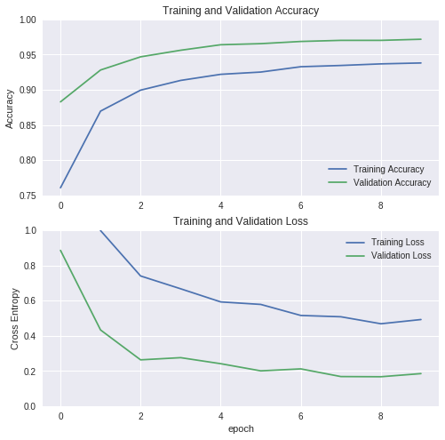
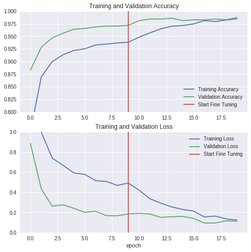

# 使用预训练的ConvNets进行迁移学习

<table class="tfo-notebook-buttons" align="left">
  <td>
    <a target="_blank" href="https://www.tensorflow.org/alpha/tutorials/images/transfer_learning">View on TensorFlow.org</a>
  </td>
  <td>
    <a target="_blank" href="https://colab.research.google.com/github/tensorflow/docs/blob/master/site/en/r2/tutorials/images/transfer_learning.ipynb">Run in Google Colab</a>
  </td>
  <td>
    <a target="_blank" href="https://github.com/tensorflow/docs/blob/master/site/en/r2/tutorials/images/transfer_learning.ipynb">View source on GitHub</a>
  </td>
</table>

在本章节中，您将学习如何使用预训练网络中的迁移学习对猫与狗图像进行分类。

预训练模型是一个保存的网路，以前在大型数据集上训练的，通常是在大规模图像分类任务上，您可以按原样使用预训练模型，也可以使用转移学习将此模型自定义为给定的任务。

转移学习背后的直觉是，如果一个模型在一个大而且足够通用的数据集上训练，这个模型将有效地作为视觉世界的通用模型。然后，您可以利用这些学习的特征映射，而无需从头开始训练大型数据集上的大型模型。

在本节中，您将尝试两种方法来自定义预训练模型：
1. **特征提取**：使用先前网络学习的表示从新样本中提取有意义的特征，您只需在与训练模型的基础上添加一个新的分类器（将从头开始训练），以便您可以重新调整先前为我们的数据集学习的特征映射。
您不需要(重新)训练整个模型，基本卷积网络已经包含了一些对图片分类非常有用的特性。然而，预训练模型的最后一个分类部分是特定于原始分类任务的，然后是特定于模型所训练的一组类。

2. **微调**：解冻冻结模型的顶层，并共同训练新添加的分类器和基础模型的最后一层，这允许我们“微调”基础模型中的高阶特征表示，以使它们与特定任务更相关。

You will follow the general machine learning workflow.

1. Examine and understand the data
2. Build an input pipeline, in this case using Keras `ImageDataGenerator`
3. Compose our model
  * Load in our pretrained base model (and pretrained weights)
  * Stack our classification layers on top
4. Train our model
5. Evaluate model

你将要遵循一般的机器学习工作流程：
1. 检查并理解数据
2. 构建输入管道，在本例中使用Keras 的 `ImageDataGenerator`
3. 构建模型
  * 加载我们的预训练基础模型（和预训练的权重）
  * 将我们的分类图层堆叠在顶部
4. 训练模型
5. 评估模型


```
from __future__ import absolute_import, division, print_function, unicode_literals

import os

import numpy as np

import matplotlib.pyplot as plt

import tensorflow as tf

keras = tf.keras
```

## 数据预处理

### 下载数据

使用 [TensorFlow Datasets](http://tensorflow.google.cn/datasets)加载猫狗数据集。`tfds` 包是加载预定义数据的最简单方法，如果您有自己的数据，并且有兴趣使用TensorFlow进行导入，请参阅[加载图像数据](https://tensorflow.google.cn/alpha/tutorials/load_data/images)。


```
import tensorflow_datasets as tfds
```

`tfds.load`方法下载并缓存数据，并返回`tf.data.Dataset`对象，这些对象提供了强大、高效的方法来处理数据并将其传递到模型中。

由于`"cats_vs_dog"` 没有定义标准分割，因此使用subsplit功能将其分为训练80%、验证10%、测试10%的数据。

```
SPLIT_WEIGHTS = (8, 1, 1)
splits = tfds.Split.TRAIN.subsplit(weighted=SPLIT_WEIGHTS)

(raw_train, raw_validation, raw_test), metadata = tfds.load(
    'cats_vs_dogs', split=list(splits),
    with_info=True, as_supervised=True)
```

生成的`tf.data.Dataset`对象包含（图像，标签）对。图像具有可变形状和3个通道，标签是标量。

```
print(raw_train)
print(raw_validation)
print(raw_test)
```

```
<DatasetV1Adapter shapes: ((None, None, 3), ()), types: (tf.uint8, tf.int64)>
<DatasetV1Adapter shapes: ((None, None, 3), ()), types: (tf.uint8, tf.int64)>
<DatasetV1Adapter shapes: ((None, None, 3), ()), types: (tf.uint8, tf.int64)>
```

显示训练集中的前两个图像和标签：

```
get_label_name = metadata.features['label'].int2str

for image, label in raw_train.take(2):
  plt.figure()
  plt.imshow(image)
  plt.title(get_label_name(label))
```


### 格式化数据

使用`tf.image`模块格式化图像，将图像调整为固定的输入大小，并将输入通道重新调整为`[-1,1]`范围。

<!-- TODO(markdaoust): fix the keras_applications preprocessing functions to work in tf2 -->

```
IMG_SIZE = 160 # 所有图像将被调整为160x160

def format_example(image, label):
  image = tf.cast(image, tf.float32)
  image = (image/127.5) - 1
  image = tf.image.resize(image, (IMG_SIZE, IMG_SIZE))
  return image, label
```

使用map方法将此函数应用于数据集中的每一个项：

```
train = raw_train.map(format_example)
validation = raw_validation.map(format_example)
test = raw_test.map(format_example)
```

打乱和批处理数据：

```
BATCH_SIZE = 32
SHUFFLE_BUFFER_SIZE = 1000

train_batches = train.shuffle(SHUFFLE_BUFFER_SIZE).batch(BATCH_SIZE)
validation_batches = validation.batch(BATCH_SIZE)
test_batches = test.batch(BATCH_SIZE)
```

检查一批数据：

```
for image_batch, label_batch in train_batches.take(1):
  pass

image_batch.shape
```

```
TensorShape([32, 160, 160, 3])
```

## 从预先训练的网络中创建基础模型

您将从Google开发的**MobileNet V2**模型创建基础模型，这是在ImageNet数据集上预先训练的，一个包含1.4M图像和1000类Web图像的大型数据集。ImageNet有一个相当随意的研究训练数据集，其中包括“jackfruit(菠萝蜜)”和“syringe(注射器)”等类别，但这个知识基础将帮助我们将猫和狗从特定数据集中区分开来。

首先，您需要选择用于特征提取的MobileNet V2层，显然，最后一个分类层（在“顶部”，因为大多数机器学习模型的图表从下到上）并不是非常有用。相反，您将遵循通常的做法在展平操作之前依赖于最后一层，该层称为“瓶颈层”，与最终/顶层相比，瓶颈层保持了很多通用性。

First, instantiate a MobileNet V2 model pre-loaded with weights trained on ImageNet. By specifying the **include_top=False** argument, you load a network that doesn't include the classification layers at the top, which is ideal for feature extraction.


```
IMG_SHAPE = (IMG_SIZE, IMG_SIZE, 3)

# Create the base model from the pre-trained model MobileNet V2
base_model = tf.keras.applications.MobileNetV2(input_shape=IMG_SHAPE,
                                               include_top=False,
                                               weights='imagenet')
```

    Downloading data from https://github.com/JonathanCMitchell/mobilenet_v2_keras/releases/download/v1.1/mobilenet_v2_weights_tf_dim_ordering_tf_kernels_1.0_160_no_top.h5
    9412608/9406464 [==============================] - 1s 0us/step


This feature extractor converts each `160x160x3` image to a `5x5x1280` block of features. See what it does to the example batch of images:


```
feature_batch = base_model(image_batch)
print(feature_batch.shape)
```

    (32, 5, 5, 1280)


## Feature extraction
You will freeze the convolutional base created from the previous step and use that as a feature extractor, add a classifier on top of it and train the top-level classifier.

### Freeze the convolutional base
It's important to freeze the convolutional based before you compile and train the model. By freezing (or setting `layer.trainable = False`), you prevent the weights in a given layer from being updated during training. MobileNet V2 has many layers, so setting the entire model's trainable flag to `False` will freeze all the layers.


```
base_model.trainable = False
```


```
# Let's take a look at the base model architecture
base_model.summary()
```

    Model: "mobilenetv2_1.00_160"
    __________________________________________________________________________________________________
    Layer (type)                    Output Shape         Param #     Connected to
    ==================================================================================================
    input_1 (InputLayer)            [(None, 160, 160, 3) 0
    __________________________________________________________________________________________________
    Conv1_pad (ZeroPadding2D)       (None, 161, 161, 3)  0           input_1[0][0]
    __________________________________________________________________________________________________
    Conv1 (Conv2D)                  (None, 80, 80, 32)   864         Conv1_pad[0][0]
    __________________________________________________________________________________________________
    bn_Conv1 (BatchNormalizationV1) (None, 80, 80, 32)   128         Conv1[0][0]
    __________________________________________________________________________________________________
    Conv1_relu (ReLU)               (None, 80, 80, 32)   0           bn_Conv1[0][0]
    __________________________________________________________________________________________________
    expanded_conv_depthwise (Depthw (None, 80, 80, 32)   288         Conv1_relu[0][0]
    __________________________________________________________________________________________________
    expanded_conv_depthwise_BN (Bat (None, 80, 80, 32)   128         expanded_conv_depthwise[0][0]
    __________________________________________________________________________________________________
    expanded_conv_depthwise_relu (R (None, 80, 80, 32)   0           expanded_conv_depthwise_BN[0][0]
    __________________________________________________________________________________________________
    expanded_conv_project (Conv2D)  (None, 80, 80, 16)   512         expanded_conv_depthwise_relu[0][0
    __________________________________________________________________________________________________
    expanded_conv_project_BN (Batch (None, 80, 80, 16)   64          expanded_conv_project[0][0]
    __________________________________________________________________________________________________
    block_1_expand (Conv2D)         (None, 80, 80, 96)   1536        expanded_conv_project_BN[0][0]
    __________________________________________________________________________________________________
    block_1_expand_BN (BatchNormali (None, 80, 80, 96)   384         block_1_expand[0][0]
    __________________________________________________________________________________________________
    block_1_expand_relu (ReLU)      (None, 80, 80, 96)   0           block_1_expand_BN[0][0]
    __________________________________________________________________________________________________
    block_1_pad (ZeroPadding2D)     (None, 81, 81, 96)   0           block_1_expand_relu[0][0]
    __________________________________________________________________________________________________
    block_1_depthwise (DepthwiseCon (None, 40, 40, 96)   864         block_1_pad[0][0]
    __________________________________________________________________________________________________
    block_1_depthwise_BN (BatchNorm (None, 40, 40, 96)   384         block_1_depthwise[0][0]
    __________________________________________________________________________________________________
    block_1_depthwise_relu (ReLU)   (None, 40, 40, 96)   0           block_1_depthwise_BN[0][0]
    __________________________________________________________________________________________________
    block_1_project (Conv2D)        (None, 40, 40, 24)   2304        block_1_depthwise_relu[0][0]
    __________________________________________________________________________________________________
    block_1_project_BN (BatchNormal (None, 40, 40, 24)   96          block_1_project[0][0]
    __________________________________________________________________________________________________
    block_2_expand (Conv2D)         (None, 40, 40, 144)  3456        block_1_project_BN[0][0]
    __________________________________________________________________________________________________
    block_2_expand_BN (BatchNormali (None, 40, 40, 144)  576         block_2_expand[0][0]
    __________________________________________________________________________________________________
    block_2_expand_relu (ReLU)      (None, 40, 40, 144)  0           block_2_expand_BN[0][0]
    __________________________________________________________________________________________________
    block_2_depthwise (DepthwiseCon (None, 40, 40, 144)  1296        block_2_expand_relu[0][0]
    __________________________________________________________________________________________________
    block_2_depthwise_BN (BatchNorm (None, 40, 40, 144)  576         block_2_depthwise[0][0]
    __________________________________________________________________________________________________
    block_2_depthwise_relu (ReLU)   (None, 40, 40, 144)  0           block_2_depthwise_BN[0][0]
    __________________________________________________________________________________________________
    block_2_project (Conv2D)        (None, 40, 40, 24)   3456        block_2_depthwise_relu[0][0]
    __________________________________________________________________________________________________
    block_2_project_BN (BatchNormal (None, 40, 40, 24)   96          block_2_project[0][0]
    __________________________________________________________________________________________________
    block_2_add (Add)               (None, 40, 40, 24)   0           block_1_project_BN[0][0]
                                                                     block_2_project_BN[0][0]
    __________________________________________________________________________________________________
    block_3_expand (Conv2D)         (None, 40, 40, 144)  3456        block_2_add[0][0]
    __________________________________________________________________________________________________
    block_3_expand_BN (BatchNormali (None, 40, 40, 144)  576         block_3_expand[0][0]
    __________________________________________________________________________________________________
    block_3_expand_relu (ReLU)      (None, 40, 40, 144)  0           block_3_expand_BN[0][0]
    __________________________________________________________________________________________________
    block_3_pad (ZeroPadding2D)     (None, 41, 41, 144)  0           block_3_expand_relu[0][0]
    __________________________________________________________________________________________________
    block_3_depthwise (DepthwiseCon (None, 20, 20, 144)  1296        block_3_pad[0][0]
    __________________________________________________________________________________________________
    block_3_depthwise_BN (BatchNorm (None, 20, 20, 144)  576         block_3_depthwise[0][0]
    __________________________________________________________________________________________________
    block_3_depthwise_relu (ReLU)   (None, 20, 20, 144)  0           block_3_depthwise_BN[0][0]
    __________________________________________________________________________________________________
    block_3_project (Conv2D)        (None, 20, 20, 32)   4608        block_3_depthwise_relu[0][0]
    __________________________________________________________________________________________________
    block_3_project_BN (BatchNormal (None, 20, 20, 32)   128         block_3_project[0][0]
    __________________________________________________________________________________________________
    block_4_expand (Conv2D)         (None, 20, 20, 192)  6144        block_3_project_BN[0][0]
    __________________________________________________________________________________________________
    block_4_expand_BN (BatchNormali (None, 20, 20, 192)  768         block_4_expand[0][0]
    __________________________________________________________________________________________________
    block_4_expand_relu (ReLU)      (None, 20, 20, 192)  0           block_4_expand_BN[0][0]
    __________________________________________________________________________________________________
    block_4_depthwise (DepthwiseCon (None, 20, 20, 192)  1728        block_4_expand_relu[0][0]
    __________________________________________________________________________________________________
    block_4_depthwise_BN (BatchNorm (None, 20, 20, 192)  768         block_4_depthwise[0][0]
    __________________________________________________________________________________________________
    block_4_depthwise_relu (ReLU)   (None, 20, 20, 192)  0           block_4_depthwise_BN[0][0]
    __________________________________________________________________________________________________
    block_4_project (Conv2D)        (None, 20, 20, 32)   6144        block_4_depthwise_relu[0][0]
    __________________________________________________________________________________________________
    block_4_project_BN (BatchNormal (None, 20, 20, 32)   128         block_4_project[0][0]
    __________________________________________________________________________________________________
    block_4_add (Add)               (None, 20, 20, 32)   0           block_3_project_BN[0][0]
                                                                     block_4_project_BN[0][0]
    __________________________________________________________________________________________________
    block_5_expand (Conv2D)         (None, 20, 20, 192)  6144        block_4_add[0][0]
    __________________________________________________________________________________________________
    block_5_expand_BN (BatchNormali (None, 20, 20, 192)  768         block_5_expand[0][0]
    __________________________________________________________________________________________________
    block_5_expand_relu (ReLU)      (None, 20, 20, 192)  0           block_5_expand_BN[0][0]
    __________________________________________________________________________________________________
    block_5_depthwise (DepthwiseCon (None, 20, 20, 192)  1728        block_5_expand_relu[0][0]
    __________________________________________________________________________________________________
    block_5_depthwise_BN (BatchNorm (None, 20, 20, 192)  768         block_5_depthwise[0][0]
    __________________________________________________________________________________________________
    block_5_depthwise_relu (ReLU)   (None, 20, 20, 192)  0           block_5_depthwise_BN[0][0]
    __________________________________________________________________________________________________
    block_5_project (Conv2D)        (None, 20, 20, 32)   6144        block_5_depthwise_relu[0][0]
    __________________________________________________________________________________________________
    block_5_project_BN (BatchNormal (None, 20, 20, 32)   128         block_5_project[0][0]
    __________________________________________________________________________________________________
    block_5_add (Add)               (None, 20, 20, 32)   0           block_4_add[0][0]
                                                                     block_5_project_BN[0][0]
    __________________________________________________________________________________________________
    block_6_expand (Conv2D)         (None, 20, 20, 192)  6144        block_5_add[0][0]
    __________________________________________________________________________________________________
    block_6_expand_BN (BatchNormali (None, 20, 20, 192)  768         block_6_expand[0][0]
    __________________________________________________________________________________________________
    block_6_expand_relu (ReLU)      (None, 20, 20, 192)  0           block_6_expand_BN[0][0]
    __________________________________________________________________________________________________
    block_6_pad (ZeroPadding2D)     (None, 21, 21, 192)  0           block_6_expand_relu[0][0]
    __________________________________________________________________________________________________
    block_6_depthwise (DepthwiseCon (None, 10, 10, 192)  1728        block_6_pad[0][0]
    __________________________________________________________________________________________________
    block_6_depthwise_BN (BatchNorm (None, 10, 10, 192)  768         block_6_depthwise[0][0]
    __________________________________________________________________________________________________
    block_6_depthwise_relu (ReLU)   (None, 10, 10, 192)  0           block_6_depthwise_BN[0][0]
    __________________________________________________________________________________________________
    block_6_project (Conv2D)        (None, 10, 10, 64)   12288       block_6_depthwise_relu[0][0]
    __________________________________________________________________________________________________
    block_6_project_BN (BatchNormal (None, 10, 10, 64)   256         block_6_project[0][0]
    __________________________________________________________________________________________________
    block_7_expand (Conv2D)         (None, 10, 10, 384)  24576       block_6_project_BN[0][0]
    __________________________________________________________________________________________________
    block_7_expand_BN (BatchNormali (None, 10, 10, 384)  1536        block_7_expand[0][0]
    __________________________________________________________________________________________________
    block_7_expand_relu (ReLU)      (None, 10, 10, 384)  0           block_7_expand_BN[0][0]
    __________________________________________________________________________________________________
    block_7_depthwise (DepthwiseCon (None, 10, 10, 384)  3456        block_7_expand_relu[0][0]
    __________________________________________________________________________________________________
    block_7_depthwise_BN (BatchNorm (None, 10, 10, 384)  1536        block_7_depthwise[0][0]
    __________________________________________________________________________________________________
    block_7_depthwise_relu (ReLU)   (None, 10, 10, 384)  0           block_7_depthwise_BN[0][0]
    __________________________________________________________________________________________________
    block_7_project (Conv2D)        (None, 10, 10, 64)   24576       block_7_depthwise_relu[0][0]
    __________________________________________________________________________________________________
    block_7_project_BN (BatchNormal (None, 10, 10, 64)   256         block_7_project[0][0]
    __________________________________________________________________________________________________
    block_7_add (Add)               (None, 10, 10, 64)   0           block_6_project_BN[0][0]
                                                                     block_7_project_BN[0][0]
    __________________________________________________________________________________________________
    block_8_expand (Conv2D)         (None, 10, 10, 384)  24576       block_7_add[0][0]
    __________________________________________________________________________________________________
    block_8_expand_BN (BatchNormali (None, 10, 10, 384)  1536        block_8_expand[0][0]
    __________________________________________________________________________________________________
    block_8_expand_relu (ReLU)      (None, 10, 10, 384)  0           block_8_expand_BN[0][0]
    __________________________________________________________________________________________________
    block_8_depthwise (DepthwiseCon (None, 10, 10, 384)  3456        block_8_expand_relu[0][0]
    __________________________________________________________________________________________________
    block_8_depthwise_BN (BatchNorm (None, 10, 10, 384)  1536        block_8_depthwise[0][0]
    __________________________________________________________________________________________________
    block_8_depthwise_relu (ReLU)   (None, 10, 10, 384)  0           block_8_depthwise_BN[0][0]
    __________________________________________________________________________________________________
    block_8_project (Conv2D)        (None, 10, 10, 64)   24576       block_8_depthwise_relu[0][0]
    __________________________________________________________________________________________________
    block_8_project_BN (BatchNormal (None, 10, 10, 64)   256         block_8_project[0][0]
    __________________________________________________________________________________________________
    block_8_add (Add)               (None, 10, 10, 64)   0           block_7_add[0][0]
                                                                     block_8_project_BN[0][0]
    __________________________________________________________________________________________________
    block_9_expand (Conv2D)         (None, 10, 10, 384)  24576       block_8_add[0][0]
    __________________________________________________________________________________________________
    block_9_expand_BN (BatchNormali (None, 10, 10, 384)  1536        block_9_expand[0][0]
    __________________________________________________________________________________________________
    block_9_expand_relu (ReLU)      (None, 10, 10, 384)  0           block_9_expand_BN[0][0]
    __________________________________________________________________________________________________
    block_9_depthwise (DepthwiseCon (None, 10, 10, 384)  3456        block_9_expand_relu[0][0]
    __________________________________________________________________________________________________
    block_9_depthwise_BN (BatchNorm (None, 10, 10, 384)  1536        block_9_depthwise[0][0]
    __________________________________________________________________________________________________
    block_9_depthwise_relu (ReLU)   (None, 10, 10, 384)  0           block_9_depthwise_BN[0][0]
    __________________________________________________________________________________________________
    block_9_project (Conv2D)        (None, 10, 10, 64)   24576       block_9_depthwise_relu[0][0]
    __________________________________________________________________________________________________
    block_9_project_BN (BatchNormal (None, 10, 10, 64)   256         block_9_project[0][0]
    __________________________________________________________________________________________________
    block_9_add (Add)               (None, 10, 10, 64)   0           block_8_add[0][0]
                                                                     block_9_project_BN[0][0]
    __________________________________________________________________________________________________
    block_10_expand (Conv2D)        (None, 10, 10, 384)  24576       block_9_add[0][0]
    __________________________________________________________________________________________________
    block_10_expand_BN (BatchNormal (None, 10, 10, 384)  1536        block_10_expand[0][0]
    __________________________________________________________________________________________________
    block_10_expand_relu (ReLU)     (None, 10, 10, 384)  0           block_10_expand_BN[0][0]
    __________________________________________________________________________________________________
    block_10_depthwise (DepthwiseCo (None, 10, 10, 384)  3456        block_10_expand_relu[0][0]
    __________________________________________________________________________________________________
    block_10_depthwise_BN (BatchNor (None, 10, 10, 384)  1536        block_10_depthwise[0][0]
    __________________________________________________________________________________________________
    block_10_depthwise_relu (ReLU)  (None, 10, 10, 384)  0           block_10_depthwise_BN[0][0]
    __________________________________________________________________________________________________
    block_10_project (Conv2D)       (None, 10, 10, 96)   36864       block_10_depthwise_relu[0][0]
    __________________________________________________________________________________________________
    block_10_project_BN (BatchNorma (None, 10, 10, 96)   384         block_10_project[0][0]
    __________________________________________________________________________________________________
    block_11_expand (Conv2D)        (None, 10, 10, 576)  55296       block_10_project_BN[0][0]
    __________________________________________________________________________________________________
    block_11_expand_BN (BatchNormal (None, 10, 10, 576)  2304        block_11_expand[0][0]
    __________________________________________________________________________________________________
    block_11_expand_relu (ReLU)     (None, 10, 10, 576)  0           block_11_expand_BN[0][0]
    __________________________________________________________________________________________________
    block_11_depthwise (DepthwiseCo (None, 10, 10, 576)  5184        block_11_expand_relu[0][0]
    __________________________________________________________________________________________________
    block_11_depthwise_BN (BatchNor (None, 10, 10, 576)  2304        block_11_depthwise[0][0]
    __________________________________________________________________________________________________
    block_11_depthwise_relu (ReLU)  (None, 10, 10, 576)  0           block_11_depthwise_BN[0][0]
    __________________________________________________________________________________________________
    block_11_project (Conv2D)       (None, 10, 10, 96)   55296       block_11_depthwise_relu[0][0]
    __________________________________________________________________________________________________
    block_11_project_BN (BatchNorma (None, 10, 10, 96)   384         block_11_project[0][0]
    __________________________________________________________________________________________________
    block_11_add (Add)              (None, 10, 10, 96)   0           block_10_project_BN[0][0]
                                                                     block_11_project_BN[0][0]
    __________________________________________________________________________________________________
    block_12_expand (Conv2D)        (None, 10, 10, 576)  55296       block_11_add[0][0]
    __________________________________________________________________________________________________
    block_12_expand_BN (BatchNormal (None, 10, 10, 576)  2304        block_12_expand[0][0]
    __________________________________________________________________________________________________
    block_12_expand_relu (ReLU)     (None, 10, 10, 576)  0           block_12_expand_BN[0][0]
    __________________________________________________________________________________________________
    block_12_depthwise (DepthwiseCo (None, 10, 10, 576)  5184        block_12_expand_relu[0][0]
    __________________________________________________________________________________________________
    block_12_depthwise_BN (BatchNor (None, 10, 10, 576)  2304        block_12_depthwise[0][0]
    __________________________________________________________________________________________________
    block_12_depthwise_relu (ReLU)  (None, 10, 10, 576)  0           block_12_depthwise_BN[0][0]
    __________________________________________________________________________________________________
    block_12_project (Conv2D)       (None, 10, 10, 96)   55296       block_12_depthwise_relu[0][0]
    __________________________________________________________________________________________________
    block_12_project_BN (BatchNorma (None, 10, 10, 96)   384         block_12_project[0][0]
    __________________________________________________________________________________________________
    block_12_add (Add)              (None, 10, 10, 96)   0           block_11_add[0][0]
                                                                     block_12_project_BN[0][0]
    __________________________________________________________________________________________________
    block_13_expand (Conv2D)        (None, 10, 10, 576)  55296       block_12_add[0][0]
    __________________________________________________________________________________________________
    block_13_expand_BN (BatchNormal (None, 10, 10, 576)  2304        block_13_expand[0][0]
    __________________________________________________________________________________________________
    block_13_expand_relu (ReLU)     (None, 10, 10, 576)  0           block_13_expand_BN[0][0]
    __________________________________________________________________________________________________
    block_13_pad (ZeroPadding2D)    (None, 11, 11, 576)  0           block_13_expand_relu[0][0]
    __________________________________________________________________________________________________
    block_13_depthwise (DepthwiseCo (None, 5, 5, 576)    5184        block_13_pad[0][0]
    __________________________________________________________________________________________________
    block_13_depthwise_BN (BatchNor (None, 5, 5, 576)    2304        block_13_depthwise[0][0]
    __________________________________________________________________________________________________
    block_13_depthwise_relu (ReLU)  (None, 5, 5, 576)    0           block_13_depthwise_BN[0][0]
    __________________________________________________________________________________________________
    block_13_project (Conv2D)       (None, 5, 5, 160)    92160       block_13_depthwise_relu[0][0]
    __________________________________________________________________________________________________
    block_13_project_BN (BatchNorma (None, 5, 5, 160)    640         block_13_project[0][0]
    __________________________________________________________________________________________________
    block_14_expand (Conv2D)        (None, 5, 5, 960)    153600      block_13_project_BN[0][0]
    __________________________________________________________________________________________________
    block_14_expand_BN (BatchNormal (None, 5, 5, 960)    3840        block_14_expand[0][0]
    __________________________________________________________________________________________________
    block_14_expand_relu (ReLU)     (None, 5, 5, 960)    0           block_14_expand_BN[0][0]
    __________________________________________________________________________________________________
    block_14_depthwise (DepthwiseCo (None, 5, 5, 960)    8640        block_14_expand_relu[0][0]
    __________________________________________________________________________________________________
    block_14_depthwise_BN (BatchNor (None, 5, 5, 960)    3840        block_14_depthwise[0][0]
    __________________________________________________________________________________________________
    block_14_depthwise_relu (ReLU)  (None, 5, 5, 960)    0           block_14_depthwise_BN[0][0]
    __________________________________________________________________________________________________
    block_14_project (Conv2D)       (None, 5, 5, 160)    153600      block_14_depthwise_relu[0][0]
    __________________________________________________________________________________________________
    block_14_project_BN (BatchNorma (None, 5, 5, 160)    640         block_14_project[0][0]
    __________________________________________________________________________________________________
    block_14_add (Add)              (None, 5, 5, 160)    0           block_13_project_BN[0][0]
                                                                     block_14_project_BN[0][0]
    __________________________________________________________________________________________________
    block_15_expand (Conv2D)        (None, 5, 5, 960)    153600      block_14_add[0][0]
    __________________________________________________________________________________________________
    block_15_expand_BN (BatchNormal (None, 5, 5, 960)    3840        block_15_expand[0][0]
    __________________________________________________________________________________________________
    block_15_expand_relu (ReLU)     (None, 5, 5, 960)    0           block_15_expand_BN[0][0]
    __________________________________________________________________________________________________
    block_15_depthwise (DepthwiseCo (None, 5, 5, 960)    8640        block_15_expand_relu[0][0]
    __________________________________________________________________________________________________
    block_15_depthwise_BN (BatchNor (None, 5, 5, 960)    3840        block_15_depthwise[0][0]
    __________________________________________________________________________________________________
    block_15_depthwise_relu (ReLU)  (None, 5, 5, 960)    0           block_15_depthwise_BN[0][0]
    __________________________________________________________________________________________________
    block_15_project (Conv2D)       (None, 5, 5, 160)    153600      block_15_depthwise_relu[0][0]
    __________________________________________________________________________________________________
    block_15_project_BN (BatchNorma (None, 5, 5, 160)    640         block_15_project[0][0]
    __________________________________________________________________________________________________
    block_15_add (Add)              (None, 5, 5, 160)    0           block_14_add[0][0]
                                                                     block_15_project_BN[0][0]
    __________________________________________________________________________________________________
    block_16_expand (Conv2D)        (None, 5, 5, 960)    153600      block_15_add[0][0]
    __________________________________________________________________________________________________
    block_16_expand_BN (BatchNormal (None, 5, 5, 960)    3840        block_16_expand[0][0]
    __________________________________________________________________________________________________
    block_16_expand_relu (ReLU)     (None, 5, 5, 960)    0           block_16_expand_BN[0][0]
    __________________________________________________________________________________________________
    block_16_depthwise (DepthwiseCo (None, 5, 5, 960)    8640        block_16_expand_relu[0][0]
    __________________________________________________________________________________________________
    block_16_depthwise_BN (BatchNor (None, 5, 5, 960)    3840        block_16_depthwise[0][0]
    __________________________________________________________________________________________________
    block_16_depthwise_relu (ReLU)  (None, 5, 5, 960)    0           block_16_depthwise_BN[0][0]
    __________________________________________________________________________________________________
    block_16_project (Conv2D)       (None, 5, 5, 320)    307200      block_16_depthwise_relu[0][0]
    __________________________________________________________________________________________________
    block_16_project_BN (BatchNorma (None, 5, 5, 320)    1280        block_16_project[0][0]
    __________________________________________________________________________________________________
    Conv_1 (Conv2D)                 (None, 5, 5, 1280)   409600      block_16_project_BN[0][0]
    __________________________________________________________________________________________________
    Conv_1_bn (BatchNormalizationV1 (None, 5, 5, 1280)   5120        Conv_1[0][0]
    __________________________________________________________________________________________________
    out_relu (ReLU)                 (None, 5, 5, 1280)   0           Conv_1_bn[0][0]
    ==================================================================================================
    Total params: 2,257,984
    Trainable params: 0
    Non-trainable params: 2,257,984
    __________________________________________________________________________________________________


### Add a classification head

To generate predictions from the block of features, average over the spatial `5x5` spatial locations, using a `tf.keras.layers.GlobalAveragePooling2D` layer to convert the features to  a single 1280-element vector per image.


```
global_average_layer = tf.keras.layers.GlobalAveragePooling2D()
feature_batch_average = global_average_layer(feature_batch)
print(feature_batch_average.shape)
```

    (32, 1280)


Apply a `tf.keras.layers.Dense` layer to convert these features into a single prediction per image. You don't need an activation function here because this prediction will be treated as a `logit`, or a raw prediciton value.  Positive numbers predict class 1, negative numbers predict class 0.


```
prediction_layer = keras.layers.Dense(1)
prediction_batch = prediction_layer(feature_batch_average)
print(prediction_batch.shape)
```

    (32, 1)


Now stack the feature extractor, and these two layers using a `tf.keras.Sequential` model:


```
model = tf.keras.Sequential([
  base_model,
  global_average_layer,
  prediction_layer
])
```

### Compile the model

You must compile the model before training it.  Since there are two classes, use a binary cross-entropy loss.


```
base_learning_rate = 0.0001
model.compile(optimizer=tf.keras.optimizers.RMSprop(lr=base_learning_rate),
              loss='binary_crossentropy',
              metrics=['accuracy'])
```


```
model.summary()
```

    Model: "sequential"
    _________________________________________________________________
    Layer (type)                 Output Shape              Param #
    =================================================================
    mobilenetv2_1.00_160 (Model) (None, 5, 5, 1280)        2257984
    _________________________________________________________________
    global_average_pooling2d (Gl (None, 1280)              0
    _________________________________________________________________
    dense (Dense)                (None, 1)                 1281
    =================================================================
    Total params: 2,259,265
    Trainable params: 1,281
    Non-trainable params: 2,257,984
    _________________________________________________________________


The 2.5M parameters in MobileNet are frozen, but there are 1.2K _trainable_ parameters in the Dense layer.  These are divided between two `tf.Variable` objects, the weights and biases.


```
len(model.trainable_variables)
```


    2


### Train the model

After training for 10 epochs, you should see ~96% accuracy.

<!-- TODO(markdaoust): delete steps_per_epoch in TensorFlow r1.14/r2.0 -->


```
num_train, num_val, num_test = (
  metadata.splits['train'].num_examples*weight/10
  for weight in SPLIT_WEIGHTS
)
```


```
initial_epochs = 10
steps_per_epoch = round(num_train)//BATCH_SIZE
validation_steps = 20

loss0,accuracy0 = model.evaluate(validation_batches, steps = validation_steps)
```

    20/20 [==============================] - 4s 219ms/step - loss: 3.1885 - accuracy: 0.6109


```
print("initial loss: {:.2f}".format(loss0))
print("initial accuracy: {:.2f}".format(accuracy0))
```

    initial loss: 3.19
    initial accuracy: 0.61


```
history = model.fit(train_batches,
                    epochs=initial_epochs,
                    validation_data=validation_batches)
```

    Epoch 1/10
    581/581 [==============================] - 102s 175ms/step - loss: 1.8917 - accuracy: 0.7606 - val_loss: 0.8860 - val_accuracy: 0.8828
    Epoch 2/10
    581/581 [==============================] - 94s 161ms/step - loss: 0.9989 - accuracy: 0.8697 - val_loss: 0.4330 - val_accuracy: 0.9281
    Epoch 3/10
    581/581 [==============================] - 99s 170ms/step - loss: 0.7417 - accuracy: 0.8995 - val_loss: 0.2629 - val_accuracy: 0.9469
    Epoch 4/10
    581/581 [==============================] - 94s 162ms/step - loss: 0.6681 - accuracy: 0.9133 - val_loss: 0.2753 - val_accuracy: 0.9563
    Epoch 5/10
    581/581 [==============================] - 98s 169ms/step - loss: 0.5944 - accuracy: 0.9220 - val_loss: 0.2410 - val_accuracy: 0.9641
    Epoch 6/10
    581/581 [==============================] - 98s 169ms/step - loss: 0.5779 - accuracy: 0.9252 - val_loss: 0.2003 - val_accuracy: 0.9656
    Epoch 7/10
    581/581 [==============================] - 94s 162ms/step - loss: 0.5151 - accuracy: 0.9328 - val_loss: 0.2115 - val_accuracy: 0.9688
    Epoch 8/10
    581/581 [==============================] - 95s 164ms/step - loss: 0.5076 - accuracy: 0.9346 - val_loss: 0.1678 - val_accuracy: 0.9703
    Epoch 9/10
    581/581 [==============================] - 96s 165ms/step - loss: 0.4679 - accuracy: 0.9368 - val_loss: 0.1668 - val_accuracy: 0.9703
    Epoch 10/10
    581/581 [==============================] - 96s 165ms/step - loss: 0.4921 - accuracy: 0.9381 - val_loss: 0.1847 - val_accuracy: 0.9719


### Learning curves

Let's take a look at the learning curves of the training and validation accuracy/loss when using the MobileNet V2 base model as a fixed feature extractor.


```
acc = history.history['accuracy']
val_acc = history.history['val_accuracy']

loss = history.history['loss']
val_loss = history.history['val_loss']

plt.figure(figsize=(8, 8))
plt.subplot(2, 1, 1)
plt.plot(acc, label='Training Accuracy')
plt.plot(val_acc, label='Validation Accuracy')
plt.legend(loc='lower right')
plt.ylabel('Accuracy')
plt.ylim([min(plt.ylim()),1])
plt.title('Training and Validation Accuracy')

plt.subplot(2, 1, 2)
plt.plot(loss, label='Training Loss')
plt.plot(val_loss, label='Validation Loss')
plt.legend(loc='upper right')
plt.ylabel('Cross Entropy')
plt.ylim([0,1.0])
plt.title('Training and Validation Loss')
plt.xlabel('epoch')
plt.show()
```





Note: If you are wondering why the validation metrics are clearly better than the training metrics, the main factor is because layers like `tf.keras.layers.BatchNormalization` and `tf.keras.layers.Dropout` affect accuracy during training. They are turned off when calculating validation loss.

To a lesser extent, it is also because training metrics report the average for an epoch, while validation metrics are evaluated after the epoch, so validation metrics see a model that has trained slightly longer.

## Fine tuning
In our feature extraction experiment, you were only training a few layers on top of an MobileNet V2 base model. The weights of the pre-trained network were **not** updated during training.

One way to increase performance even further is to train (or "fine-tune") the weights of the top layers of the pre-trained model alongside the training of the classifier you added. The training process will force the weights to be tuned from generic features maps to features associated specifically to our dataset.

Note: This should only be attempted after you have trained the top-level classifier with the pre-trained model set to non-trainable. If you add a randomly initialized classifier on top of a pre-trained model and attempt to train all layers jointly, the magnitude of the gradient updates will be too large (due to the random weights from the classifier) and your pre-trained model will forget what it has learned.

Also, you should try to fine-tune a small number of top layers rather than the whole MobileNet model. In most convolutional networks, the higher up a layer is, the more specialized it is. The first few layers learn very simple and generic features which generalize to almost all types of images. As you go higher up, the features are increasingly more specific to the dataset on which the model was trained. The goal of fine-tuning is to adapt these specialized features to work with the new dataset, rather than overwrite the generic learning.

### Un-freeze the top layers of the model


All you need to do is unfreeze the `base_model` and set the bottom layers be un-trainable. Then, you should recompile the model (necessary for these changes to take effect), and resume training.


```
base_model.trainable = True
```


```
# Let's take a look to see how many layers are in the base model
print("Number of layers in the base model: ", len(base_model.layers))

# Fine tune from this layer onwards
fine_tune_at = 100

# Freeze all the layers before the `fine_tune_at` layer
for layer in base_model.layers[:fine_tune_at]:
  layer.trainable =  False
```

    Number of layers in the base model:  155


### Compile the model

Compile the model using a much lower training rate.


```
model.compile(loss='binary_crossentropy',
              optimizer = tf.keras.optimizers.RMSprop(lr=base_learning_rate/10),
              metrics=['accuracy'])
```


```
model.summary()
```

    Model: "sequential"
    _________________________________________________________________
    Layer (type)                 Output Shape              Param #
    =================================================================
    mobilenetv2_1.00_160 (Model) (None, 5, 5, 1280)        2257984
    _________________________________________________________________
    global_average_pooling2d (Gl (None, 1280)              0
    _________________________________________________________________
    dense (Dense)                (None, 1)                 1281
    =================================================================
    Total params: 2,259,265
    Trainable params: 1,863,873
    Non-trainable params: 395,392
    _________________________________________________________________


```
len(model.trainable_variables)
```


    58


### Continue Train the model

If you trained to convergence earlier, this will get you a few percent more accuracy.


```
fine_tune_epochs = 10
total_epochs =  initial_epochs + fine_tune_epochs

history_fine = model.fit(train_batches,
                         epochs=total_epochs,
                         initial_epoch = initial_epochs,
                         validation_data=validation_batches)
```

    Epoch 11/20
    581/581 [==============================] - 134s 231ms/step - loss: 0.4208 - accuracy: 0.9484 - val_loss: 0.1907 - val_accuracy: 0.9812
    Epoch 12/20
    581/581 [==============================] - 114s 197ms/step - loss: 0.3359 - accuracy: 0.9570 - val_loss: 0.1835 - val_accuracy: 0.9844
    Epoch 13/20
    581/581 [==============================] - 116s 200ms/step - loss: 0.2930 - accuracy: 0.9650 - val_loss: 0.1505 - val_accuracy: 0.9844
    Epoch 14/20
    581/581 [==============================] - 114s 196ms/step - loss: 0.2561 - accuracy: 0.9701 - val_loss: 0.1575 - val_accuracy: 0.9859
    Epoch 15/20
    581/581 [==============================] - 119s 206ms/step - loss: 0.2302 - accuracy: 0.9715 - val_loss: 0.1600 - val_accuracy: 0.9812
    Epoch 16/20
    581/581 [==============================] - 115s 197ms/step - loss: 0.2134 - accuracy: 0.9747 - val_loss: 0.1407 - val_accuracy: 0.9828
    Epoch 17/20
    581/581 [==============================] - 115s 197ms/step - loss: 0.1546 - accuracy: 0.9813 - val_loss: 0.0944 - val_accuracy: 0.9828
    Epoch 18/20
    581/581 [==============================] - 116s 200ms/step - loss: 0.1636 - accuracy: 0.9794 - val_loss: 0.0947 - val_accuracy: 0.9844
    Epoch 19/20
    581/581 [==============================] - 115s 198ms/step - loss: 0.1356 - accuracy: 0.9823 - val_loss: 0.1169 - val_accuracy: 0.9828
    Epoch 20/20
    581/581 [==============================] - 116s 199ms/step - loss: 0.1243 - accuracy: 0.9849 - val_loss: 0.1121 - val_accuracy: 0.9875


Let's take a look at the learning curves of the training and validation accuracy/loss, when fine tuning the last few layers of the MobileNet V2 base model and training the classifier on top of it. The validation loss is much higher than the training loss, so you may get some overfitting.

You may also get some overfitting as the new training set is relatively small and similar to the original MobileNet V2 datasets.


After fine tuning the model nearly reaches 98% accuracy.


```
acc += history_fine.history['accuracy']
val_acc += history_fine.history['val_accuracy']

loss += history_fine.history['loss']
val_loss += history_fine.history['val_loss']
```


```
plt.figure(figsize=(8, 8))
plt.subplot(2, 1, 1)
plt.plot(acc, label='Training Accuracy')
plt.plot(val_acc, label='Validation Accuracy')
plt.ylim([0.8, 1])
plt.plot([initial_epochs-1,initial_epochs-1],
          plt.ylim(), label='Start Fine Tuning')
plt.legend(loc='lower right')
plt.title('Training and Validation Accuracy')

plt.subplot(2, 1, 2)
plt.plot(loss, label='Training Loss')
plt.plot(val_loss, label='Validation Loss')
plt.ylim([0, 1.0])
plt.plot([initial_epochs-1,initial_epochs-1],
         plt.ylim(), label='Start Fine Tuning')
plt.legend(loc='upper right')
plt.title('Training and Validation Loss')
plt.xlabel('epoch')
plt.show()
```





## Summary:

* **Using a pre-trained model for feature extraction**:  When working with a small dataset, it is common to take advantage of features learned by a model trained on a larger dataset in the same domain. This is done by instantiating the pre-trained model and adding a fully-connected classifier on top. The pre-trained model is "frozen" and only the weights of the classifier get updated during training.
In this case, the convolutional base extracted all the features associated with each image and you just trained a classifier that determines the image class given that set of extracted features.

* **Fine-tuning a pre-trained model**: To further improve performance, one might want to repurpose the top-level layers of the pre-trained models to the new dataset via fine-tuning.
In this case, you tuned your weights such that your model learned high-level features specific to the dataset. This technique is usually recommended when the training dataset is large and very similar to the orginial dataset that the pre-trained model was trained on.

