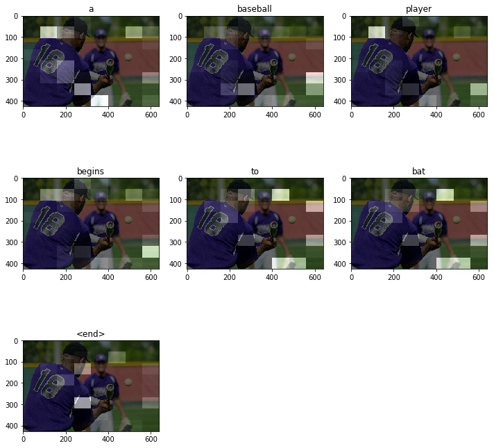
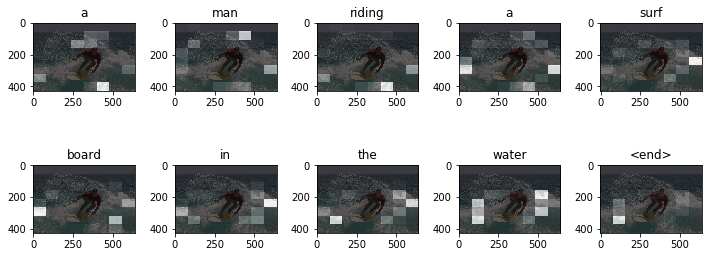

##### Copyright 2018 The TensorFlow Authors.


```
#@title Licensed under the Apache License, Version 2.0 (the "License");
# you may not use this file except in compliance with the License.
# You may obtain a copy of the License at
#
# https://www.apache.org/licenses/LICENSE-2.0
#
# Unless required by applicable law or agreed to in writing, software
# distributed under the License is distributed on an "AS IS" BASIS,
# WITHOUT WARRANTIES OR CONDITIONS OF ANY KIND, either express or implied.
# See the License for the specific language governing permissions and
# limitations under the License.
```

# Image Captioning with Attention

<table class="tfo-notebook-buttons" align="left">
  <td>
    <a target="_blank" href="https://www.tensorflow.org/alpha/tutorials/text/image_captioning">
    
    View on TensorFlow.org</a>
  </td>
  <td>
    <a target="_blank" href="https://colab.research.google.com/github/tensorflow/docs/blob/master/site/en/r2/tutorials/text/image_captioning.ipynb">
    
    Run in Google Colab</a>
  </td>
  <td>
    <a target="_blank" href="https://github.com/tensorflow/docs/blob/master/site/en/r2/tutorials/text/image_captioning.ipynb">
    
    View source on GitHub</a>
  </td>
</table>

Given an image like the below, our goal is to generate a caption, such as "a surfer riding on a wave".


*[Image Source](https://commons.wikimedia.org/wiki/Surfing#/media/File:Surfing_in_Hawaii.jpg), License: Public Domain*

Here, we'll use an attention-based model. This enables us to see which parts of the image the model focuses on as it generates a caption.


This model architecture below is similar to [Show, Attend and Tell: Neural Image Caption Generation with Visual Attention](https://arxiv.org/abs/1502.03044).

This notebook is an end-to-end example. When run, it will download the  [MS-COCO](http://cocodataset.org/#home) dataset, preprocess and cache a subset of the images using Inception V3, train an encoder-decoder model, and use it to generate captions on new images.

In this example, you will train a model on a relatively small amount of data.The model will be trained on the first 30,000 captions (corresponding to about ~20,000 images depending on shuffling, as there are multiple captions per image in the dataset).


```
from __future__ import absolute_import, division, print_function, unicode_literals
```


```
!pip install tensorflow-gpu==2.0.0-alpha0
import tensorflow as tf

# We'll generate plots of attention in order to see which parts of an image
# our model focuses on during captioning
import matplotlib.pyplot as plt

# Scikit-learn includes many helpful utilities
from sklearn.model_selection import train_test_split
from sklearn.utils import shuffle

import re
import numpy as np
import os
import time
import json
from glob import glob
from PIL import Image
import pickle
```

## Download and prepare the MS-COCO dataset

We will use the [MS-COCO dataset](http://cocodataset.org/#home) to train our model. This dataset contains >82,000 images, each of which has been annotated with at least 5 different captions. The code below will download and extract the dataset automatically.

**Caution: large download ahead**. We'll use the training set, it's a 13GB file.


```
annotation_zip = tf.keras.utils.get_file('captions.zip',
                                          cache_subdir=os.path.abspath('.'),
                                          origin = 'http://images.cocodataset.org/annotations/annotations_trainval2014.zip',
                                          extract = True)
annotation_file = os.path.dirname(annotation_zip)+'/annotations/captions_train2014.json'

name_of_zip = 'train2014.zip'
if not os.path.exists(os.path.abspath('.') + '/' + name_of_zip):
  image_zip = tf.keras.utils.get_file(name_of_zip,
                                      cache_subdir=os.path.abspath('.'),
                                      origin = 'http://images.cocodataset.org/zips/train2014.zip',
                                      extract = True)
  PATH = os.path.dirname(image_zip)+'/train2014/'
else:
  PATH = os.path.abspath('.')+'/train2014/'
```

## Optionally, limit the size of the training set for faster training
For this example, we'll select a subset of 30,000 captions and use these and the corresponding images to train our model. As always, captioning quality will improve if you choose to use more data.


```
# read the json file
with open(annotation_file, 'r') as f:
    annotations = json.load(f)

# storing the captions and the image name in vectors
all_captions = []
all_img_name_vector = []

for annot in annotations['annotations']:
    caption = '<start> ' + annot['caption'] + ' <end>'
    image_id = annot['image_id']
    full_coco_image_path = PATH + 'COCO_train2014_' + '%012d.jpg' % (image_id)

    all_img_name_vector.append(full_coco_image_path)
    all_captions.append(caption)

# shuffling the captions and image_names together
# setting a random state
train_captions, img_name_vector = shuffle(all_captions,
                                          all_img_name_vector,
                                          random_state=1)

# selecting the first 30000 captions from the shuffled set
num_examples = 30000
train_captions = train_captions[:num_examples]
img_name_vector = img_name_vector[:num_examples]
```


```
len(train_captions), len(all_captions)
```


    (30000, 414113)


## Preprocess the images using InceptionV3
Next, we will use InceptionV3 (pretrained on Imagenet) to classify each image. We will extract features from the last convolutional layer.

First, we will need to convert the images into the format inceptionV3 expects by:
* Resizing the image to (299, 299)
* Using the [preprocess_input](https://www.tensorflow.org/api_docs/python/tf/keras/applications/inception_v3/preprocess_input) method to place the pixels in the range of -1 to 1 (to match the format of the images used to train InceptionV3).


```
def load_image(image_path):
    img = tf.io.read_file(image_path)
    img = tf.image.decode_jpeg(img, channels=3)
    img = tf.image.resize(img, (299, 299))
    img = tf.keras.applications.inception_v3.preprocess_input(img)
    return img, image_path
```

## Initialize InceptionV3 and load the pretrained Imagenet weights

To do so, we'll create a tf.keras model where the output layer is the last convolutional layer in the InceptionV3 architecture.
* Each image is forwarded through the network and the vector that we get at the end is stored in a dictionary (image_name --> feature_vector).
* We use the last convolutional layer because we are using attention in this example. The shape of the output of this layer is ```8x8x2048```.
* We avoid doing this during training so it does not become a bottleneck.
* After all the images are passed through the network, we pickle the dictionary and save it to disk.


```
image_model = tf.keras.applications.InceptionV3(include_top=False,
                                                weights='imagenet')
new_input = image_model.input
hidden_layer = image_model.layers[-1].output

image_features_extract_model = tf.keras.Model(new_input, hidden_layer)
```

## Caching the features extracted from InceptionV3

We will pre-process each image with InceptionV3 and cache the output to disk. Caching the output in RAM would be faster but memory intensive, requiring 8 \* 8 \* 2048 floats per image. At the time of writing, this would exceed the memory limitations of Colab (although these may change, an instance appears to have about 12GB of memory currently).

Performance could be improved with a more sophisticated caching strategy (e.g., by sharding the images to reduce random access disk I/O) at the cost of more code.

This will take about 10 minutes to run in Colab with a GPU. If you'd like to see a progress bar, you could: install [tqdm](https://github.com/tqdm/tqdm) (```!pip install tqdm```), import it (```from tqdm import tqdm```), then change this line: 

```for img, path in image_dataset:```

to:

```for img, path in tqdm(image_dataset):```.


```
# getting the unique images
encode_train = sorted(set(img_name_vector))

# feel free to change the batch_size according to your system configuration
image_dataset = tf.data.Dataset.from_tensor_slices(encode_train)
image_dataset = image_dataset.map(
  load_image, num_parallel_calls=tf.data.experimental.AUTOTUNE).batch(16)

for img, path in image_dataset:
  batch_features = image_features_extract_model(img)
  batch_features = tf.reshape(batch_features,
                              (batch_features.shape[0], -1, batch_features.shape[3]))

  for bf, p in zip(batch_features, path):
    path_of_feature = p.numpy().decode("utf-8")
    np.save(path_of_feature, bf.numpy())
```

## Preprocess and tokenize the captions

* First, we'll tokenize the captions (e.g., by splitting on spaces). This will give us a  vocabulary of all the unique words in the data (e.g., "surfing", "football", etc).
* Next, we'll limit the vocabulary size to the top 5,000 words to save memory. We'll replace all other words with the token "UNK" (for unknown).
* Finally, we create a word --> index mapping and vice-versa.
* We will then pad all sequences to the be same length as the longest one.


```
# This will find the maximum length of any caption in our dataset
def calc_max_length(tensor):
    return max(len(t) for t in tensor)
```


```
# The steps above is a general process of dealing with text processing

# choosing the top 5000 words from the vocabulary
top_k = 5000
tokenizer = tf.keras.preprocessing.text.Tokenizer(num_words=top_k,
                                                  oov_token="<unk>",
                                                  filters='!"#$%&()*+.,-/:;=?@[\]^_`{|}~ ')
tokenizer.fit_on_texts(train_captions)
train_seqs = tokenizer.texts_to_sequences(train_captions)
```


```
tokenizer.word_index['<pad>'] = 0
tokenizer.index_word[0] = '<pad>'
```


```
# creating the tokenized vectors
train_seqs = tokenizer.texts_to_sequences(train_captions)
```


```
# padding each vector to the max_length of the captions
# if the max_length parameter is not provided, pad_sequences calculates that automatically
cap_vector = tf.keras.preprocessing.sequence.pad_sequences(train_seqs, padding='post')
```


```
# calculating the max_length
# used to store the attention weights
max_length = calc_max_length(train_seqs)
```

## Split the data into training and testing


```
# Create training and validation sets using 80-20 split
img_name_train, img_name_val, cap_train, cap_val = train_test_split(img_name_vector,
                                                                    cap_vector,
                                                                    test_size=0.2,
                                                                    random_state=0)
```


```
len(img_name_train), len(cap_train), len(img_name_val), len(cap_val)
```


    (24000, 24000, 6000, 6000)


## Our images and captions are ready! Next, let's create a tf.data dataset to use for training our model.


```
# feel free to change these parameters according to your system's configuration

BATCH_SIZE = 64
BUFFER_SIZE = 1000
embedding_dim = 256
units = 512
vocab_size = len(tokenizer.word_index) + 1
num_steps = len(img_name_train) // BATCH_SIZE
# shape of the vector extracted from InceptionV3 is (64, 2048)
# these two variables represent that
features_shape = 2048
attention_features_shape = 64
```


```
# loading the numpy files
def map_func(img_name, cap):
  img_tensor = np.load(img_name.decode('utf-8')+'.npy')
  return img_tensor, cap
```


```
dataset = tf.data.Dataset.from_tensor_slices((img_name_train, cap_train))

# using map to load the numpy files in parallel
dataset = dataset.map(lambda item1, item2: tf.numpy_function(
          map_func, [item1, item2], [tf.float32, tf.int32]),
          num_parallel_calls=tf.data.experimental.AUTOTUNE)

# shuffling and batching
dataset = dataset.shuffle(BUFFER_SIZE).batch(BATCH_SIZE)
dataset = dataset.prefetch(buffer_size=tf.data.experimental.AUTOTUNE)
```

## Model

Fun fact, the decoder below is identical to the one in the example for [Neural Machine Translation with Attention](../sequences/nmt_with_attention.ipynb).

The model architecture is inspired by the [Show, Attend and Tell](https://arxiv.org/pdf/1502.03044.pdf) paper.

* In this example, we extract the features from the lower convolutional layer of InceptionV3 giving us a vector of shape (8, 8, 2048).
* We squash that to a shape of (64, 2048).
* This vector is then passed through the CNN Encoder(which consists of a single Fully connected layer).
* The RNN(here GRU) attends over the image to predict the next word.


```
class BahdanauAttention(tf.keras.Model):
  def __init__(self, units):
    super(BahdanauAttention, self).__init__()
    self.W1 = tf.keras.layers.Dense(units)
    self.W2 = tf.keras.layers.Dense(units)
    self.V = tf.keras.layers.Dense(1)

  def call(self, features, hidden):
    # features(CNN_encoder output) shape == (batch_size, 64, embedding_dim)

    # hidden shape == (batch_size, hidden_size)
    # hidden_with_time_axis shape == (batch_size, 1, hidden_size)
    hidden_with_time_axis = tf.expand_dims(hidden, 1)

    # score shape == (batch_size, 64, hidden_size)
    score = tf.nn.tanh(self.W1(features) + self.W2(hidden_with_time_axis))

    # attention_weights shape == (batch_size, 64, 1)
    # we get 1 at the last axis because we are applying score to self.V
    attention_weights = tf.nn.softmax(self.V(score), axis=1)

    # context_vector shape after sum == (batch_size, hidden_size)
    context_vector = attention_weights * features
    context_vector = tf.reduce_sum(context_vector, axis=1)

    return context_vector, attention_weights
```


```
class CNN_Encoder(tf.keras.Model):
    # Since we have already extracted the features and dumped it using pickle
    # This encoder passes those features through a Fully connected layer
    def __init__(self, embedding_dim):
        super(CNN_Encoder, self).__init__()
        # shape after fc == (batch_size, 64, embedding_dim)
        self.fc = tf.keras.layers.Dense(embedding_dim)

    def call(self, x):
        x = self.fc(x)
        x = tf.nn.relu(x)
        return x
```


```
class RNN_Decoder(tf.keras.Model):
  def __init__(self, embedding_dim, units, vocab_size):
    super(RNN_Decoder, self).__init__()
    self.units = units

    self.embedding = tf.keras.layers.Embedding(vocab_size, embedding_dim)
    self.gru = tf.keras.layers.GRU(self.units,
                                   return_sequences=True,
                                   return_state=True,
                                   recurrent_initializer='glorot_uniform')
    self.fc1 = tf.keras.layers.Dense(self.units)
    self.fc2 = tf.keras.layers.Dense(vocab_size)

    self.attention = BahdanauAttention(self.units)

  def call(self, x, features, hidden):
    # defining attention as a separate model
    context_vector, attention_weights = self.attention(features, hidden)

    # x shape after passing through embedding == (batch_size, 1, embedding_dim)
    x = self.embedding(x)

    # x shape after concatenation == (batch_size, 1, embedding_dim + hidden_size)
    x = tf.concat([tf.expand_dims(context_vector, 1), x], axis=-1)

    # passing the concatenated vector to the GRU
    output, state = self.gru(x)

    # shape == (batch_size, max_length, hidden_size)
    x = self.fc1(output)

    # x shape == (batch_size * max_length, hidden_size)
    x = tf.reshape(x, (-1, x.shape[2]))

    # output shape == (batch_size * max_length, vocab)
    x = self.fc2(x)

    return x, state, attention_weights

  def reset_state(self, batch_size):
    return tf.zeros((batch_size, self.units))
```


```
encoder = CNN_Encoder(embedding_dim)
decoder = RNN_Decoder(embedding_dim, units, vocab_size)
```


```
optimizer = tf.keras.optimizers.Adam()
loss_object = tf.keras.losses.SparseCategoricalCrossentropy(
    from_logits=True, reduction='none')

def loss_function(real, pred):
  mask = tf.math.logical_not(tf.math.equal(real, 0))
  loss_ = loss_object(real, pred)

  mask = tf.cast(mask, dtype=loss_.dtype)
  loss_ *= mask

  return tf.reduce_mean(loss_)
```

## Checkpoint


```
checkpoint_path = "./checkpoints/train"
ckpt = tf.train.Checkpoint(encoder=encoder,
                           decoder=decoder,
                           optimizer = optimizer)
ckpt_manager = tf.train.CheckpointManager(ckpt, checkpoint_path, max_to_keep=5)
```


```
start_epoch = 0
if ckpt_manager.latest_checkpoint:
  start_epoch = int(ckpt_manager.latest_checkpoint.split('-')[-1])
```

## Training

* We extract the features stored in the respective `.npy` files and then pass those features through the encoder.
* The encoder output, hidden state(initialized to 0) and the decoder input (which is the start token) is passed to the decoder.
* The decoder returns the predictions and the decoder hidden state.
* The decoder hidden state is then passed back into the model and the predictions are used to calculate the loss.
* Use teacher forcing to decide the next input to the decoder.
* Teacher forcing is the technique where the target word is passed as the next input to the decoder.
* The final step is to calculate the gradients and apply it to the optimizer and backpropagate.


```
# adding this in a separate cell because if you run the training cell
# many times, the loss_plot array will be reset
loss_plot = []
```


```
@tf.function
def train_step(img_tensor, target):
  loss = 0

  # initializing the hidden state for each batch
  # because the captions are not related from image to image
  hidden = decoder.reset_state(batch_size=target.shape[0])

  dec_input = tf.expand_dims([tokenizer.word_index['<start>']] * BATCH_SIZE, 1)

  with tf.GradientTape() as tape:
      features = encoder(img_tensor)

      for i in range(1, target.shape[1]):
          # passing the features through the decoder
          predictions, hidden, _ = decoder(dec_input, features, hidden)

          loss += loss_function(target[:, i], predictions)

          # using teacher forcing
          dec_input = tf.expand_dims(target[:, i], 1)

  total_loss = (loss / int(target.shape[1]))

  trainable_variables = encoder.trainable_variables + decoder.trainable_variables

  gradients = tape.gradient(loss, trainable_variables)

  optimizer.apply_gradients(zip(gradients, trainable_variables))

  return loss, total_loss
```


```
EPOCHS = 20

for epoch in range(start_epoch, EPOCHS):
    start = time.time()
    total_loss = 0

    for (batch, (img_tensor, target)) in enumerate(dataset):
        batch_loss, t_loss = train_step(img_tensor, target)
        total_loss += t_loss

        if batch % 100 == 0:
            print ('Epoch {} Batch {} Loss {:.4f}'.format(
              epoch + 1, batch, batch_loss.numpy() / int(target.shape[1])))
    # storing the epoch end loss value to plot later
    loss_plot.append(total_loss / num_steps)

    if epoch % 5 == 0:
      ckpt_manager.save()

    print ('Epoch {} Loss {:.6f}'.format(epoch + 1,
                                         total_loss/num_steps))
    print ('Time taken for 1 epoch {} sec\n'.format(time.time() - start))
```

    Epoch 1 Batch 0 Loss 2.0556
    Epoch 1 Batch 100 Loss 1.0668
    Epoch 1 Batch 200 Loss 0.8879
    Epoch 1 Batch 300 Loss 0.8524
    Epoch 1 Loss 1.009767
    Time taken for 1 epoch 256.95692324638367 sec
    
    Epoch 2 Batch 0 Loss 0.8081
    Epoch 2 Batch 100 Loss 0.7681
    Epoch 2 Batch 200 Loss 0.6946
    Epoch 2 Batch 300 Loss 0.7042
    Epoch 2 Loss 0.756167
    Time taken for 1 epoch 186.68594098091125 sec
    
    Epoch 3 Batch 0 Loss 0.6851
    Epoch 3 Batch 100 Loss 0.6817
    Epoch 3 Batch 200 Loss 0.6316
    Epoch 3 Batch 300 Loss 0.6391
    Epoch 3 Loss 0.679992
    Time taken for 1 epoch 186.36522102355957 sec
    
    Epoch 4 Batch 0 Loss 0.6381
    Epoch 4 Batch 100 Loss 0.6314
    Epoch 4 Batch 200 Loss 0.5915
    Epoch 4 Batch 300 Loss 0.5961
    Epoch 4 Loss 0.635389
    Time taken for 1 epoch 186.6236436367035 sec
    
    Epoch 5 Batch 0 Loss 0.5991
    Epoch 5 Batch 100 Loss 0.5896
    Epoch 5 Batch 200 Loss 0.5607
    Epoch 5 Batch 300 Loss 0.5670
    Epoch 5 Loss 0.602497
    Time taken for 1 epoch 187.06984400749207 sec
    
    Epoch 6 Batch 0 Loss 0.5679
    Epoch 6 Batch 100 Loss 0.5558
    Epoch 6 Batch 200 Loss 0.5350
    Epoch 6 Batch 300 Loss 0.5461
    Epoch 6 Loss 0.575848
    Time taken for 1 epoch 187.72310757637024 sec
    
    Epoch 7 Batch 0 Loss 0.5503
    Epoch 7 Batch 100 Loss 0.5283
    Epoch 7 Batch 200 Loss 0.5120
    Epoch 7 Batch 300 Loss 0.5242
    Epoch 7 Loss 0.551446
    Time taken for 1 epoch 187.74794459342957 sec
    
    Epoch 8 Batch 0 Loss 0.5432
    Epoch 8 Batch 100 Loss 0.5078
    Epoch 8 Batch 200 Loss 0.5003
    Epoch 8 Batch 300 Loss 0.4915
    Epoch 8 Loss 0.529145
    Time taken for 1 epoch 186.81623315811157 sec
    
    Epoch 9 Batch 0 Loss 0.5156
    Epoch 9 Batch 100 Loss 0.4842
    Epoch 9 Batch 200 Loss 0.4923
    Epoch 9 Batch 300 Loss 0.4677
    Epoch 9 Loss 0.509899
    Time taken for 1 epoch 189.49438571929932 sec
    
    Epoch 10 Batch 0 Loss 0.4995
    Epoch 10 Batch 100 Loss 0.4710
    Epoch 10 Batch 200 Loss 0.4750
    Epoch 10 Batch 300 Loss 0.4601
    Epoch 10 Loss 0.492096
    Time taken for 1 epoch 189.16131472587585 sec
    
    Epoch 11 Batch 0 Loss 0.4797
    Epoch 11 Batch 100 Loss 0.4495
    Epoch 11 Batch 200 Loss 0.4552
    Epoch 11 Batch 300 Loss 0.4408
    Epoch 11 Loss 0.474645
    Time taken for 1 epoch 190.57548332214355 sec
    
    Epoch 12 Batch 0 Loss 0.4787
    Epoch 12 Batch 100 Loss 0.4315
    Epoch 12 Batch 200 Loss 0.4504
    Epoch 12 Batch 300 Loss 0.4293
    Epoch 12 Loss 0.457647
    Time taken for 1 epoch 190.24215531349182 sec
    
    Epoch 13 Batch 0 Loss 0.4621
    Epoch 13 Batch 100 Loss 0.4107
    Epoch 13 Batch 200 Loss 0.4271
    Epoch 13 Batch 300 Loss 0.4133
    Epoch 13 Loss 0.442507
    Time taken for 1 epoch 187.96875071525574 sec
    
    Epoch 14 Batch 0 Loss 0.4383
    Epoch 14 Batch 100 Loss 0.3987
    Epoch 14 Batch 200 Loss 0.4239
    Epoch 14 Batch 300 Loss 0.3913
    Epoch 14 Loss 0.429215
    Time taken for 1 epoch 185.89738130569458 sec
    
    Epoch 15 Batch 0 Loss 0.4121
    Epoch 15 Batch 100 Loss 0.3933
    Epoch 15 Batch 200 Loss 0.4079
    Epoch 15 Batch 300 Loss 0.3788
    Epoch 15 Loss 0.415965
    Time taken for 1 epoch 186.6773328781128 sec
    
    Epoch 16 Batch 0 Loss 0.4062
    Epoch 16 Batch 100 Loss 0.3752
    Epoch 16 Batch 200 Loss 0.3947
    Epoch 16 Batch 300 Loss 0.3715
    Epoch 16 Loss 0.402814
    Time taken for 1 epoch 186.04795384407043 sec
    
    Epoch 17 Batch 0 Loss 0.3793
    Epoch 17 Batch 100 Loss 0.3604
    Epoch 17 Batch 200 Loss 0.3941
    Epoch 17 Batch 300 Loss 0.3504
    Epoch 17 Loss 0.391162
    Time taken for 1 epoch 187.62019681930542 sec
    
    Epoch 18 Batch 0 Loss 0.3685
    Epoch 18 Batch 100 Loss 0.3496
    Epoch 18 Batch 200 Loss 0.3744
    Epoch 18 Batch 300 Loss 0.3480
    Epoch 18 Loss 0.382786
    Time taken for 1 epoch 185.68778085708618 sec
    
    Epoch 19 Batch 0 Loss 0.3608
    Epoch 19 Batch 100 Loss 0.3384
    Epoch 19 Batch 200 Loss 0.3500
    Epoch 19 Batch 300 Loss 0.3229
    Epoch 19 Loss 0.371033
    Time taken for 1 epoch 185.8159191608429 sec
    
    Epoch 20 Batch 0 Loss 0.3568
    Epoch 20 Batch 100 Loss 0.3288
    Epoch 20 Batch 200 Loss 0.3357
    Epoch 20 Batch 300 Loss 0.2945
    Epoch 20 Loss 0.358618
    Time taken for 1 epoch 186.8766734600067 sec
    


```
plt.plot(loss_plot)
plt.xlabel('Epochs')
plt.ylabel('Loss')
plt.title('Loss Plot')
plt.show()
```


## Caption!

* The evaluate function is similar to the training loop, except we don't use teacher forcing here. The input to the decoder at each time step is its previous predictions along with the hidden state and the encoder output.
* Stop predicting when the model predicts the end token.
* And store the attention weights for every time step.


```
def evaluate(image):
    attention_plot = np.zeros((max_length, attention_features_shape))

    hidden = decoder.reset_state(batch_size=1)

    temp_input = tf.expand_dims(load_image(image)[0], 0)
    img_tensor_val = image_features_extract_model(temp_input)
    img_tensor_val = tf.reshape(img_tensor_val, (img_tensor_val.shape[0], -1, img_tensor_val.shape[3]))

    features = encoder(img_tensor_val)

    dec_input = tf.expand_dims([tokenizer.word_index['<start>']], 0)
    result = []

    for i in range(max_length):
        predictions, hidden, attention_weights = decoder(dec_input, features, hidden)

        attention_plot[i] = tf.reshape(attention_weights, (-1, )).numpy()

        predicted_id = tf.argmax(predictions[0]).numpy()
        result.append(tokenizer.index_word[predicted_id])

        if tokenizer.index_word[predicted_id] == '<end>':
            return result, attention_plot

        dec_input = tf.expand_dims([predicted_id], 0)

    attention_plot = attention_plot[:len(result), :]
    return result, attention_plot
```


```
def plot_attention(image, result, attention_plot):
    temp_image = np.array(Image.open(image))

    fig = plt.figure(figsize=(10, 10))

    len_result = len(result)
    for l in range(len_result):
        temp_att = np.resize(attention_plot[l], (8, 8))
        ax = fig.add_subplot(len_result//2, len_result//2, l+1)
        ax.set_title(result[l])
        img = ax.imshow(temp_image)
        ax.imshow(temp_att, cmap='gray', alpha=0.6, extent=img.get_extent())

    plt.tight_layout()
    plt.show()
```


```
# captions on the validation set
rid = np.random.randint(0, len(img_name_val))
image = img_name_val[rid]
real_caption = ' '.join([tokenizer.index_word[i] for i in cap_val[rid] if i not in [0]])
result, attention_plot = evaluate(image)

print ('Real Caption:', real_caption)
print ('Prediction Caption:', ' '.join(result))
plot_attention(image, result, attention_plot)
# opening the image
Image.open(img_name_val[rid])
```

    Real Caption: <start> a man gets ready to hit a ball with a bat <end>
    Prediction Caption: a baseball player begins to bat <end>





## Try it on your own images
For fun, below we've provided a method you can use to caption your own images with the model we've just trained. Keep in mind, it was trained on a relatively small amount of data, and your images may be different from the training data (so be prepared for weird results!)


```
image_url = 'https://tensorflow.org/images/surf.jpg'
image_extension = image_url[-4:]
image_path = tf.keras.utils.get_file('image'+image_extension,
                                     origin=image_url)

result, attention_plot = evaluate(image_path)
print ('Prediction Caption:', ' '.join(result))
plot_attention(image_path, result, attention_plot)
# opening the image
Image.open(image_path)
```

    Prediction Caption: a man riding a surf board in the water <end>





# Next steps

Congrats! You've just trained an image captioning model with attention. Next, we recommend taking a look at this example [Neural Machine Translation with Attention](../sequences/nmt_with_attention.ipynb). It uses a similar architecture to translate between Spanish and English sentences. You can also experiment with training the code in this notebook on a different dataset.
