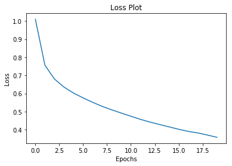

# 使用注意力机制给出图片标题 (tensorflow2.0官方教程翻译)

给定如下图像，我们的目标是生成一个标题，例如“冲浪者骑在波浪上”。


在这里，我们将使用基于注意力的模型。这使我们能够在生成标题时查看模型关注的图像部分。


模型体系结构类似于论文[Show, Attend and Tell: Neural Image Caption Generation with Visual Attention](https://arxiv.org/abs/1502.03044).

本教程是一个端到端的例子。当您运行时，它下载 [MS-COCO](http://cocodataset.org/#home) 数据集，使用Inception V3对图像子集进行预处理和缓存，训练一个编解码器模型，并使用训练过的模型对新图像生成标题。

在本例中，您将使用相对较少的数据来训练模型，大约20,000张图像对应30,000个标题(因为数据集中每个图像都有多个标题)。

导入库

```python
from __future__ import absolute_import, division, print_function, unicode_literals

import tensorflow as tf

# We'll generate plots of attention in order to see which parts of an image
# our model focuses on during captioning
import matplotlib.pyplot as plt

# Scikit-learn includes many helpful utilities
from sklearn.model_selection import train_test_split
from sklearn.utils import shuffle

import re
import numpy as np
import os
import time
import json
from glob import glob
from PIL import Image
import pickle
```

## 1. 下载并准备MS-COCO数据集

您将使用MS-COCO数据集来训练我们的模型。该数据集包含超过82,000个图像，每个图像至少有5个不同的标题注释。下面的代码自动下载并提取数据集。
注意：训练集是一个13GB的文件。

```python
annotation_zip = tf.keras.utils.get_file('captions.zip',
                                          cache_subdir=os.path.abspath('.'),
                                          origin = 'http://images.cocodataset.org/annotations/annotations_trainval2014.zip',
                                          extract = True)
annotation_file = os.path.dirname(annotation_zip)+'/annotations/captions_train2014.json'

name_of_zip = 'train2014.zip'
if not os.path.exists(os.path.abspath('.') + '/' + name_of_zip):
  image_zip = tf.keras.utils.get_file(name_of_zip,
                                      cache_subdir=os.path.abspath('.'),
                                      origin = 'http://images.cocodataset.org/zips/train2014.zip',
                                      extract = True)
  PATH = os.path.dirname(image_zip)+'/train2014/'
else:
  PATH = os.path.abspath('.')+'/train2014/'
```

## 2. （可选）限制训练集的大小以加快训练速度

对于本例，我们将选择30,000个标题的子集，并使用这些标题和相应的图像来训练我们的模型。与往常一样，如果您选择使用更多的数据，标题质量将会提高。

```python
# read the json file
with open(annotation_file, 'r') as f:
    annotations = json.load(f)

# storing the captions and the image name in vectors
all_captions = []
all_img_name_vector = []

for annot in annotations['annotations']:
    caption = '<start> ' + annot['caption'] + ' <end>'
    image_id = annot['image_id']
    full_coco_image_path = PATH + 'COCO_train2014_' + '%012d.jpg' % (image_id)

    all_img_name_vector.append(full_coco_image_path)
    all_captions.append(caption)

# shuffling the captions and image_names together
# setting a random state
train_captions, img_name_vector = shuffle(all_captions,
                                          all_img_name_vector,
                                          random_state=1)

# selecting the first 30000 captions from the shuffled set
num_examples = 30000
train_captions = train_captions[:num_examples]
img_name_vector = img_name_vector[:num_examples]
```


```python
len(train_captions), len(all_captions)
```

```
    (30000, 414113)
```

## 3. 使用InceptionV3预处理图像

接下来，我们将使用InceptionV3（在Imagenet上预训练）对每个图像进行分类。我们将从最后一个卷积层中提取特征。

首先，我们需要将图像转换成inceptionV3期望的格式:
* 将图像大小调整为299px×299px
* 使用[preprocess_input](https://www.tensorflow.org/api_docs/python/tf/keras/applications/inception_v3/preprocess_input)方法对图像进行预处理，使图像规范化，使其包含-1到1范围内的像素，这与用于训练InceptionV3的图像的格式相匹配。

```python
def load_image(image_path):
    img = tf.io.read_file(image_path)
    img = tf.image.decode_jpeg(img, channels=3)
    img = tf.image.resize(img, (299, 299))
    img = tf.keras.applications.inception_v3.preprocess_input(img)
    return img, image_path
```

## 4. 初始化InceptionV3并加载预训练的Imagenet权重

现在您将创建一个 tf.keras 模型，其中输出层是 InceptionV3 体系结构中的最后一个卷积层。该层的输出形状为 `8x8x2048` 。使用最后一个卷积层是因为在这个例子中使用了注意力。您不会在训练期间执行此初始化，因为它可能会成为瓶颈。
* 您通过网络转发每个图像并将结果向量存储在字典中(image_name --> feature_vector)
* 在所有图像通过网络传递之后，您挑选字典并将其保存到磁盘。

```python
image_model = tf.keras.applications.InceptionV3(include_top=False,
                                                weights='imagenet')
new_input = image_model.input
hidden_layer = image_model.layers[-1].output

image_features_extract_model = tf.keras.Model(new_input, hidden_layer)
```

## 5. 缓存从InceptionV3中提取的特性

您将使用InceptionV3预处理每个映像并将输出缓存到磁盘。缓存RAM中的输出会更快但内存密集，每个映像需要 8 \* 8 \* 2048 个浮点数。在撰写本文时，这超出了Colab的内存限制（目前为12GB内存）。

可以通过更复杂的缓存策略（例如，通过分割图像以减少随机访问磁盘 I/O）来提高性能，但这需要更多代码。

使用GPU在Clab中运行大约需要10分钟。如果您想查看进度条，可以：
使用GPU在Colab中运行大约需要10分钟。如果你想看到一个进度条，你可以：
* 安装[tqdm](https://github.com/tqdm/tqdm) (```!pip install tqdm```)，
* 导入它(```from tqdm import tqdm```)，
* 然后改变这一行：

```for img, path in image_dataset:```

to:

```for img, path in tqdm(image_dataset):```.


```python
# getting the unique images
encode_train = sorted(set(img_name_vector))

# feel free to change the batch_size according to your system configuration
image_dataset = tf.data.Dataset.from_tensor_slices(encode_train)
image_dataset = image_dataset.map(
  load_image, num_parallel_calls=tf.data.experimental.AUTOTUNE).batch(16)

for img, path in image_dataset:
  batch_features = image_features_extract_model(img)
  batch_features = tf.reshape(batch_features,
                              (batch_features.shape[0], -1, batch_features.shape[3]))

  for bf, p in zip(batch_features, path):
    path_of_feature = p.numpy().decode("utf-8")
    np.save(path_of_feature, bf.numpy())
```

## 6. 对标题进行预处理和标记

* 首先，您将对标题进行标记（例如，通过拆分空格）。这为我们提供了数据中所有独特单词的词汇表（例如，“冲浪”，“足球”等）。
* 接下来，您将词汇量限制为前5,000个单词（以节省内存）。您将使用令牌“UNK”（未知）替换所有其他单词。
* 然后，您可以创建单词到索引和索引到单词的映射。
* 最后，将所有序列填充到与最长序列相同的长度。

```python
# This will find the maximum length of any caption in our dataset
def calc_max_length(tensor):
    return max(len(t) for t in tensor)
```


```python
# The steps above is a general process of dealing with text processing

# choosing the top 5000 words from the vocabulary
top_k = 5000
tokenizer = tf.keras.preprocessing.text.Tokenizer(num_words=top_k,
                                                  oov_token="<unk>",
                                                  filters='!"#$%&()*+.,-/:;=?@[\]^_`{|}~ ')
tokenizer.fit_on_texts(train_captions)
train_seqs = tokenizer.texts_to_sequences(train_captions)
```


```python
tokenizer.word_index['<pad>'] = 0
tokenizer.index_word[0] = '<pad>'
```


```python
# creating the tokenized vectors
train_seqs = tokenizer.texts_to_sequences(train_captions)
```


```python
# padding each vector to the max_length of the captions
# if the max_length parameter is not provided, pad_sequences calculates that automatically
cap_vector = tf.keras.preprocessing.sequence.pad_sequences(train_seqs, padding='post')
```


```python
# calculating the max_length
# used to store the attention weights
max_length = calc_max_length(train_seqs)
```

## 7. 将数据分解为训练和测试


```python
# Create training and validation sets using 80-20 split
img_name_train, img_name_val, cap_train, cap_val = train_test_split(img_name_vector,
                                                                    cap_vector,
                                                                    test_size=0.2,
                                                                    random_state=0)
```


```python
len(img_name_train), len(cap_train), len(img_name_val), len(cap_val)
```

```
    (24000, 24000, 6000, 6000)
```


## 8. 创建用于训练的tf.data数据集

我们的图片和标题已准备就绪！接下来，让我们创建一个tf.data数据集来用于训练我们的模型。

```python
# feel free to change these parameters according to your system's configuration

BATCH_SIZE = 64
BUFFER_SIZE = 1000
embedding_dim = 256
units = 512
vocab_size = len(tokenizer.word_index) + 1
num_steps = len(img_name_train) // BATCH_SIZE
# shape of the vector extracted from InceptionV3 is (64, 2048)
# these two variables represent that
features_shape = 2048
attention_features_shape = 64
```


```python
# loading the numpy files
def map_func(img_name, cap):
  img_tensor = np.load(img_name.decode('utf-8')+'.npy')
  return img_tensor, cap
```


```python
dataset = tf.data.Dataset.from_tensor_slices((img_name_train, cap_train))

# using map to load the numpy files in parallel
dataset = dataset.map(lambda item1, item2: tf.numpy_function(
          map_func, [item1, item2], [tf.float32, tf.int32]),
          num_parallel_calls=tf.data.experimental.AUTOTUNE)

# shuffling and batching
dataset = dataset.shuffle(BUFFER_SIZE).batch(BATCH_SIZE)
dataset = dataset.prefetch(buffer_size=tf.data.experimental.AUTOTUNE)
```

## 9. 模型


有趣的事实：下面的解码器与 [注意神经机器翻译的示例](https://tensorflow.google.cn/alpha/tutorials/text/nmt_with_attention)中的解码器相同。

模型架构的灵感来自论文 [Show, Attend and Tell](https://arxiv.org/pdf/1502.03044.pdf) 。

* 在这个例子中，你从InceptionV3的下卷积层中提取特征，给我们一个形状矢量(8, 8, 2048).
* 你将它压成（64,2048）的形状。
* 然后，该向量通过CNN编码器（由单个完全连接的层组成）。
* RNN（此处为GRU）参与图像以预测下一个单词。


```python
class BahdanauAttention(tf.keras.Model):
  def __init__(self, units):
    super(BahdanauAttention, self).__init__()
    self.W1 = tf.keras.layers.Dense(units)
    self.W2 = tf.keras.layers.Dense(units)
    self.V = tf.keras.layers.Dense(1)

  def call(self, features, hidden):
    # features(CNN_encoder output) shape == (batch_size, 64, embedding_dim)

    # hidden shape == (batch_size, hidden_size)
    # hidden_with_time_axis shape == (batch_size, 1, hidden_size)
    hidden_with_time_axis = tf.expand_dims(hidden, 1)

    # score shape == (batch_size, 64, hidden_size)
    score = tf.nn.tanh(self.W1(features) + self.W2(hidden_with_time_axis))

    # attention_weights shape == (batch_size, 64, 1)
    # we get 1 at the last axis because we are applying score to self.V
    attention_weights = tf.nn.softmax(self.V(score), axis=1)

    # context_vector shape after sum == (batch_size, hidden_size)
    context_vector = attention_weights * features
    context_vector = tf.reduce_sum(context_vector, axis=1)

    return context_vector, attention_weights
```


```python
class CNN_Encoder(tf.keras.Model):
    # Since we have already extracted the features and dumped it using pickle
    # This encoder passes those features through a Fully connected layer
    def __init__(self, embedding_dim):
        super(CNN_Encoder, self).__init__()
        # shape after fc == (batch_size, 64, embedding_dim)
        self.fc = tf.keras.layers.Dense(embedding_dim)

    def call(self, x):
        x = self.fc(x)
        x = tf.nn.relu(x)
        return x
```


```python
class RNN_Decoder(tf.keras.Model):
  def __init__(self, embedding_dim, units, vocab_size):
    super(RNN_Decoder, self).__init__()
    self.units = units

    self.embedding = tf.keras.layers.Embedding(vocab_size, embedding_dim)
    self.gru = tf.keras.layers.GRU(self.units,
                                   return_sequences=True,
                                   return_state=True,
                                   recurrent_initializer='glorot_uniform')
    self.fc1 = tf.keras.layers.Dense(self.units)
    self.fc2 = tf.keras.layers.Dense(vocab_size)

    self.attention = BahdanauAttention(self.units)

  def call(self, x, features, hidden):
    # defining attention as a separate model
    context_vector, attention_weights = self.attention(features, hidden)

    # x shape after passing through embedding == (batch_size, 1, embedding_dim)
    x = self.embedding(x)

    # x shape after concatenation == (batch_size, 1, embedding_dim + hidden_size)
    x = tf.concat([tf.expand_dims(context_vector, 1), x], axis=-1)

    # passing the concatenated vector to the GRU
    output, state = self.gru(x)

    # shape == (batch_size, max_length, hidden_size)
    x = self.fc1(output)

    # x shape == (batch_size * max_length, hidden_size)
    x = tf.reshape(x, (-1, x.shape[2]))

    # output shape == (batch_size * max_length, vocab)
    x = self.fc2(x)

    return x, state, attention_weights

  def reset_state(self, batch_size):
    return tf.zeros((batch_size, self.units))
```


```python
encoder = CNN_Encoder(embedding_dim)
decoder = RNN_Decoder(embedding_dim, units, vocab_size)
```


```python
optimizer = tf.keras.optimizers.Adam()
loss_object = tf.keras.losses.SparseCategoricalCrossentropy(
    from_logits=True, reduction='none')

def loss_function(real, pred):
  mask = tf.math.logical_not(tf.math.equal(real, 0))
  loss_ = loss_object(real, pred)

  mask = tf.cast(mask, dtype=loss_.dtype)
  loss_ *= mask

  return tf.reduce_mean(loss_)
```

## 10. Checkpoint 检查点


```python
checkpoint_path = "./checkpoints/train"
ckpt = tf.train.Checkpoint(encoder=encoder,
                           decoder=decoder,
                           optimizer = optimizer)
ckpt_manager = tf.train.CheckpointManager(ckpt, checkpoint_path, max_to_keep=5)
```


```python
start_epoch = 0
if ckpt_manager.latest_checkpoint:
  start_epoch = int(ckpt_manager.latest_checkpoint.split('-')[-1])
```

## 11. 训练

* 您提取各自.npy文件中存储的特性，然后通过编码器传递这些特性。
* 编码器输出，隐藏状态（初始化为0）和解码器输入（它是开始标记）被传递给解码器。
* 解码器返回预测和解码器隐藏状态。
* 然后将解码器隐藏状态传递回模型，并使用预测来计算损失。
* 使用teacher forcing决定解码器的下一个输入。
* Teacher forcing 是将目标字作为下一个输入传递给解码器的技术。
* 最后一步是计算梯度，并将其应用于优化器和反向传播。


```python
# adding this in a separate cell because if you run the training cell
# many times, the loss_plot array will be reset
loss_plot = []
```


```python
@tf.function
def train_step(img_tensor, target):
  loss = 0

  # initializing the hidden state for each batch
  # because the captions are not related from image to image
  hidden = decoder.reset_state(batch_size=target.shape[0])

  dec_input = tf.expand_dims([tokenizer.word_index['<start>']] * BATCH_SIZE, 1)

  with tf.GradientTape() as tape:
      features = encoder(img_tensor)

      for i in range(1, target.shape[1]):
          # passing the features through the decoder
          predictions, hidden, _ = decoder(dec_input, features, hidden)

          loss += loss_function(target[:, i], predictions)

          # using teacher forcing
          dec_input = tf.expand_dims(target[:, i], 1)

  total_loss = (loss / int(target.shape[1]))

  trainable_variables = encoder.trainable_variables + decoder.trainable_variables

  gradients = tape.gradient(loss, trainable_variables)

  optimizer.apply_gradients(zip(gradients, trainable_variables))

  return loss, total_loss
```


```python
EPOCHS = 20

for epoch in range(start_epoch, EPOCHS):
    start = time.time()
    total_loss = 0

    for (batch, (img_tensor, target)) in enumerate(dataset):
        batch_loss, t_loss = train_step(img_tensor, target)
        total_loss += t_loss

        if batch % 100 == 0:
            print ('Epoch {} Batch {} Loss {:.4f}'.format(
              epoch + 1, batch, batch_loss.numpy() / int(target.shape[1])))
    # storing the epoch end loss value to plot later
    loss_plot.append(total_loss / num_steps)

    if epoch % 5 == 0:
      ckpt_manager.save()

    print ('Epoch {} Loss {:.6f}'.format(epoch + 1,
                                         total_loss/num_steps))
    print ('Time taken for 1 epoch {} sec\n'.format(time.time() - start))
```

```
    ......
    Epoch 20 Batch 0 Loss 0.3568
    Epoch 20 Batch 100 Loss 0.3288
    Epoch 20 Batch 200 Loss 0.3357
    Epoch 20 Batch 300 Loss 0.2945
    Epoch 20 Loss 0.358618
    Time taken for 1 epoch 186.8766734600067 sec
    
```


```python
plt.plot(loss_plot)
plt.xlabel('Epochs')
plt.ylabel('Loss')
plt.title('Loss Plot')
plt.show()
```




## 12. 标题!

* 评估函数类似于训练循环，只是这里不使用 teacher forcing 。解码器在每个时间步长的输入是其先前的预测，以及隐藏状态和编码器的输出。
* 当模型预测结束令牌时停止预测。
* 并存储每个时间步的注意力。


```python
def evaluate(image):
    attention_plot = np.zeros((max_length, attention_features_shape))

    hidden = decoder.reset_state(batch_size=1)

    temp_input = tf.expand_dims(load_image(image)[0], 0)
    img_tensor_val = image_features_extract_model(temp_input)
    img_tensor_val = tf.reshape(img_tensor_val, (img_tensor_val.shape[0], -1, img_tensor_val.shape[3]))

    features = encoder(img_tensor_val)

    dec_input = tf.expand_dims([tokenizer.word_index['<start>']], 0)
    result = []

    for i in range(max_length):
        predictions, hidden, attention_weights = decoder(dec_input, features, hidden)

        attention_plot[i] = tf.reshape(attention_weights, (-1, )).numpy()

        predicted_id = tf.argmax(predictions[0]).numpy()
        result.append(tokenizer.index_word[predicted_id])

        if tokenizer.index_word[predicted_id] == '<end>':
            return result, attention_plot

        dec_input = tf.expand_dims([predicted_id], 0)

    attention_plot = attention_plot[:len(result), :]
    return result, attention_plot
```


```python
def plot_attention(image, result, attention_plot):
    temp_image = np.array(Image.open(image))

    fig = plt.figure(figsize=(10, 10))

    len_result = len(result)
    for l in range(len_result):
        temp_att = np.resize(attention_plot[l], (8, 8))
        ax = fig.add_subplot(len_result//2, len_result//2, l+1)
        ax.set_title(result[l])
        img = ax.imshow(temp_image)
        ax.imshow(temp_att, cmap='gray', alpha=0.6, extent=img.get_extent())

    plt.tight_layout()
    plt.show()
```


```python
# captions on the validation set
rid = np.random.randint(0, len(img_name_val))
image = img_name_val[rid]
real_caption = ' '.join([tokenizer.index_word[i] for i in cap_val[rid] if i not in [0]])
result, attention_plot = evaluate(image)

print ('Real Caption:', real_caption)
print ('Prediction Caption:', ' '.join(result))
plot_attention(image, result, attention_plot)
# opening the image
Image.open(img_name_val[rid])
```

```
    Real Caption: <start> a man gets ready to hit a ball with a bat <end>
    Prediction Caption: a baseball player begins to bat <end>
```


## 13. 在你自己的图片上试试

为了好玩，下面我们提供了一种方法，您可以使用我们刚刚训练过的模型为您自己的图像添加标题。请记住，它是在相对少量的数据上训练的，您的图像可能与训练数据不同（因此请为奇怪的结果做好准备！）

```python
image_url = 'https://tensorflow.org/images/surf.jpg'
image_extension = image_url[-4:]
image_path = tf.keras.utils.get_file('image'+image_extension,
                                     origin=image_url)

result, attention_plot = evaluate(image_path)
print ('Prediction Caption:', ' '.join(result))
plot_attention(image_path, result, attention_plot)
# opening the image
Image.open(image_path)
```

```
    Prediction Caption: a man riding a surf board in the water <end>
```


# 下一步

恭喜！您刚刚训练了一个注意力机制给图像取标题的模型。接下来，看一下这个[使用注意力机制的神经机器翻译示例](https://tensorflow.google.cn/alpha/tutorials/text/nmt_with_attention)。它使用类似的架构来翻译西班牙语和英语句子。您还可以尝试在不同的数据集上训练此笔记本中的代码。

> 最新版本：[https://www.mashangxue123.com/tensorflow/tf2-tutorials-text-image_captioning.html](https://www.mashangxue123.com/tensorflow/tf2-tutorials-text-image_captioning.html)
> 英文版本：[https://tensorflow.google.cn/alpha/tutorials/text/image_captioning](https://tensorflow.google.cn/alpha/tutorials/text/image_captioning)
> 翻译建议PR：[https://github.com/mashangxue/tensorflow2-zh/edit/master/r2/tutorials/text/image_captioning.md](https://github.com/mashangxue/tensorflow2-zh/edit/master/r2/tutorials/text/image_captioning.md)