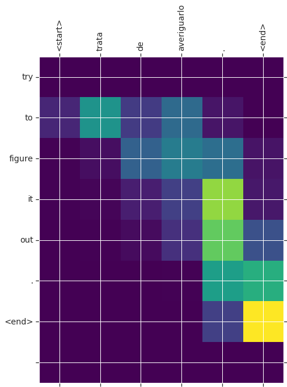

# 采用注意力机制的神经机器翻译(tensorflow2.0官方教程翻译)

本教程训练一个序列到序列 (seq2seq)模型，实现西班牙语到英语的翻译。这是一个高级示例，要求您对序列到序列模型有一定的了解。

训练模型后，输入一个西班牙语句子将返回对应英文翻译，例如 *"¿todavia estan en casa?"* ，返回 *"are you still at home?"*

对于一个玩具例子来说，翻译质量是合理的，但是生成的注意情节可能更有趣。这说明在翻译过程中，模型注意到了输入句子的哪些部分:


注意：此示例在单个P100 GPU上运行大约需要10分钟。

```python
from __future__ import absolute_import, division, print_function, unicode_literals

import tensorflow as tf

import matplotlib.pyplot as plt
from sklearn.model_selection import train_test_split

import unicodedata
import re
import numpy as np
import os
import io
import time
```

## 1. 下载并准备数据集

我们将使用 http://www.manythings.org/anki/  提供的语言数据集。此数据集包含以下格式的语言翻译对：

```
May I borrow this book?	¿Puedo tomar prestado este libro?
```

有多种语言可供选择，但我们将使用英语 - 西班牙语数据集。为方便起见，我们在Google Cloud上托管了此数据集的副本，但您也可以下载自己的副本。下载数据集后，以下是我们准备数据的步骤：

1. 为每个句子添加开始和结束标记。
2. 删除特殊字符来清除句子。
3. 创建一个单词索引和反向单词索引（从单词→id和id→单词映射的字典）。
4. 将每个句子填充到最大长度。


```python
# Download the file
path_to_zip = tf.keras.utils.get_file(
    'spa-eng.zip', origin='http://storage.googleapis.com/download.tensorflow.org/data/spa-eng.zip',
    extract=True)

path_to_file = os.path.dirname(path_to_zip)+"/spa-eng/spa.txt"
```

```output
    Downloading data from http://storage.googleapis.com/download.tensorflow.org/data/spa-eng.zip
    2646016/2638744 [==============================] - 0s 0us/step
    2654208/2638744 [==============================] - 0s 0us/step
```

```python
# Converts the unicode file to ascii
def unicode_to_ascii(s):
    return ''.join(c for c in unicodedata.normalize('NFD', s)
        if unicodedata.category(c) != 'Mn')


def preprocess_sentence(w):
    w = unicode_to_ascii(w.lower().strip())

    # creating a space between a word and the punctuation following it
    # eg: "he is a boy." => "he is a boy ."
    # Reference:- https://stackoverflow.com/questions/3645931/python-padding-punctuation-with-white-spaces-keeping-punctuation
    w = re.sub(r"([?.!,¿])", r" \1 ", w)
    w = re.sub(r'[" "]+', " ", w)

    # replacing everything with space except (a-z, A-Z, ".", "?", "!", ",")
    w = re.sub(r"[^a-zA-Z?.!,¿]+", " ", w)

    w = w.rstrip().strip()

    # adding a start and an end token to the sentence
    # so that the model know when to start and stop predicting.
    w = '<start> ' + w + ' <end>'
    return w
```


```python
en_sentence = u"May I borrow this book?"
sp_sentence = u"¿Puedo tomar prestado este libro?"
print(preprocess_sentence(en_sentence))
print(preprocess_sentence(sp_sentence).encode('utf-8'))
```

```output
    <start> may i borrow this book ? <end>
    <start> ¿ puedo tomar prestado este libro ? <end>
```

```python
# 1. Remove the accents
# 2. Clean the sentences
# 3. Return word pairs in the format: [ENGLISH, SPANISH]
def create_dataset(path, num_examples):
    lines = io.open(path, encoding='UTF-8').read().strip().split('\n')

    word_pairs = [[preprocess_sentence(w) for w in l.split('\t')]  for l in lines[:num_examples]]

    return zip(*word_pairs)
```


```python
en, sp = create_dataset(path_to_file, None)
print(en[-1])
print(sp[-1])
```

```output
    <start> if you want to sound like a native speaker , you must be willing to practice saying the same sentence over and over in the same way that banjo players practice the same phrase over and over until they can play it correctly and at the desired tempo . <end>
    <start> si quieres sonar como un hablante nativo , debes estar dispuesto a practicar diciendo la misma frase una y otra vez de la misma manera en que un musico de banjo practica el mismo fraseo una y otra vez hasta que lo puedan tocar correctamente y en el tiempo esperado . <end>
```


```python
def max_length(tensor):
    return max(len(t) for t in tensor)
```


```python
def tokenize(lang):
  lang_tokenizer = tf.keras.preprocessing.text.Tokenizer(
      filters='')
  lang_tokenizer.fit_on_texts(lang)

  tensor = lang_tokenizer.texts_to_sequences(lang)

  tensor = tf.keras.preprocessing.sequence.pad_sequences(tensor,
                                                         padding='post')

  return tensor, lang_tokenizer
```


```python
def load_dataset(path, num_examples=None):
    # creating cleaned input, output pairs
    targ_lang, inp_lang = create_dataset(path, num_examples)

    input_tensor, inp_lang_tokenizer = tokenize(inp_lang)
    target_tensor, targ_lang_tokenizer = tokenize(targ_lang)

    return input_tensor, target_tensor, inp_lang_tokenizer, targ_lang_tokenizer
```

### 1.1. 限制数据集的大小以更快地进行实验（可选）

对 > 100,000个句子的完整数据集进行训练需要很长时间。为了更快地训练，我们可以将数据集的大小限制为30,000个句子（当然，翻译质量会随着数据的减少而降低）：

```python
# Try experimenting with the size of that dataset
num_examples = 30000
input_tensor, target_tensor, inp_lang, targ_lang = load_dataset(path_to_file, num_examples)

# Calculate max_length of the target tensors
max_length_targ, max_length_inp = max_length(target_tensor), max_length(input_tensor)
```


```python
# Creating training and validation sets using an 80-20 split
input_tensor_train, input_tensor_val, target_tensor_train, target_tensor_val = train_test_split(input_tensor, target_tensor, test_size=0.2)

# Show length
len(input_tensor_train), len(target_tensor_train), len(input_tensor_val), len(target_tensor_val)
```

```output
    (24000, 24000, 6000, 6000)
```


```python
def convert(lang, tensor):
  for t in tensor:
    if t!=0:
      print ("%d ----> %s" % (t, lang.index_word[t]))
```


```python
print ("Input Language; index to word mapping")
convert(inp_lang, input_tensor_train[0])
print ()
print ("Target Language; index to word mapping")
convert(targ_lang, target_tensor_train[0])
```

```output
    Input Language; index to word mapping
    1 ----> <start>
    8 ----> no
    38 ----> puedo
    804 ----> confiar
    20 ----> en
    1000 ----> vosotras
    3 ----> .
    2 ----> <end>
    
    Target Language; index to word mapping
    1 ----> <start>
    4 ----> i
    25 ----> can
    12 ----> t
    345 ----> trust
    6 ----> you
    3 ----> .
    2 ----> <end>
```

### 1.2. 创建 `tf.data` 数据集


```python
BUFFER_SIZE = len(input_tensor_train)
BATCH_SIZE = 64
steps_per_epoch = len(input_tensor_train)//BATCH_SIZE
embedding_dim = 256
units = 1024
vocab_inp_size = len(inp_lang.word_index)+1
vocab_tar_size = len(targ_lang.word_index)+1

dataset = tf.data.Dataset.from_tensor_slices((input_tensor_train, target_tensor_train)).shuffle(BUFFER_SIZE)
dataset = dataset.batch(BATCH_SIZE, drop_remainder=True)
```


```python
example_input_batch, example_target_batch = next(iter(dataset))
example_input_batch.shape, example_target_batch.shape
```

```output
    (TensorShape([64, 16]), TensorShape([64, 11]))
```


## 2. 编写编码器和解码器模型

我们将实现一个使用注意力机制的编码器-解码器模型，您可以在TensorFlow [神经机器翻译（seq2seq）教程](https://www.tensorflow.org/tutorials/seq2seq)中阅读。此示例使用更新的API集，实现了seq2seq教程中的注意方程式。下图显示了每个输入单词由注意机制分配权重，然后解码器使用该权重来预测句子中的下一个单词。


通过编码器模型输入，该模型给出了形状 *(batch_size, max_length, hidden_size)* 的编码器输出和形状 *(batch_size, hidden_size)* 的编码器隐藏状态。

下面是实现的方程:


我们用的是 *Bahdanau attention* 。在写出简化形式之前，我们先来定义符号:

* FC = Fully connected (dense) layer 完全连接（密集）层
* EO = Encoder output 编码器输出
* H = hidden state 隐藏的状态
* X = input to the decoder 输入到解码器

定义伪代码：

* `score = FC(tanh(FC(EO) + FC(H)))`

* `attention weights = softmax(score, axis = 1)`. 默认情况下Softmax应用于最后一个轴，但是我们要在 *第一轴* 上应用它，因为得分的形状是 *(batch_size, max_length, hidden_size)* 。`Max_length` 是我们输入的长度。由于我们尝试为每个输入分配权重，因此应在该轴上应用softmax。

* `context vector = sum(attention weights * EO, axis = 1)`. 选择轴为1的原因与上述相同。

* `embedding output` = 译码器X的输入通过嵌入层传递

* `merged vector = concat(embedding output, context vector)`

* 将该合并的矢量提供给GRU

每个步骤中所有向量的形状都已在代码中的注释中指定：

```python
class Encoder(tf.keras.Model):
  def __init__(self, vocab_size, embedding_dim, enc_units, batch_sz):
    super(Encoder, self).__init__()
    self.batch_sz = batch_sz
    self.enc_units = enc_units
    self.embedding = tf.keras.layers.Embedding(vocab_size, embedding_dim)
    self.gru = tf.keras.layers.GRU(self.enc_units,
                                   return_sequences=True,
                                   return_state=True,
                                   recurrent_initializer='glorot_uniform')

  def call(self, x, hidden):
    x = self.embedding(x)
    output, state = self.gru(x, initial_state = hidden)
    return output, state

  def initialize_hidden_state(self):
    return tf.zeros((self.batch_sz, self.enc_units))
```


```python
encoder = Encoder(vocab_inp_size, embedding_dim, units, BATCH_SIZE)

# sample input
sample_hidden = encoder.initialize_hidden_state()
sample_output, sample_hidden = encoder(example_input_batch, sample_hidden)
print ('Encoder output shape: (batch size, sequence length, units) {}'.format(sample_output.shape))
print ('Encoder Hidden state shape: (batch size, units) {}'.format(sample_hidden.shape))
```

```output
    Encoder output shape: (batch size, sequence length, units) (64, 16, 1024)
    Encoder Hidden state shape: (batch size, units) (64, 1024)
```


```python
class BahdanauAttention(tf.keras.Model):
  def __init__(self, units):
    super(BahdanauAttention, self).__init__()
    self.W1 = tf.keras.layers.Dense(units)
    self.W2 = tf.keras.layers.Dense(units)
    self.V = tf.keras.layers.Dense(1)

  def call(self, query, values):
    # hidden shape == (batch_size, hidden size)
    # hidden_with_time_axis shape == (batch_size, 1, hidden size)
    # we are doing this to perform addition to calculate the score
    hidden_with_time_axis = tf.expand_dims(query, 1)

    # score shape == (batch_size, max_length, hidden_size)
    score = self.V(tf.nn.tanh(
        self.W1(values) + self.W2(hidden_with_time_axis)))

    # attention_weights shape == (batch_size, max_length, 1)
    # we get 1 at the last axis because we are applying score to self.V
    attention_weights = tf.nn.softmax(score, axis=1)

    # context_vector shape after sum == (batch_size, hidden_size)
    context_vector = attention_weights * values
    context_vector = tf.reduce_sum(context_vector, axis=1)

    return context_vector, attention_weights
```


```python
attention_layer = BahdanauAttention(10)
attention_result, attention_weights = attention_layer(sample_hidden, sample_output)

print("Attention result shape: (batch size, units) {}".format(attention_result.shape))
print("Attention weights shape: (batch_size, sequence_length, 1) {}".format(attention_weights.shape))
```

```output
    Attention result shape: (batch size, units) (64, 1024)
    Attention weights shape: (batch_size, sequence_length, 1) (64, 16, 1)
```


```
class Decoder(tf.keras.Model):
  def __init__(self, vocab_size, embedding_dim, dec_units, batch_sz):
    super(Decoder, self).__init__()
    self.batch_sz = batch_sz
    self.dec_units = dec_units
    self.embedding = tf.keras.layers.Embedding(vocab_size, embedding_dim)
    self.gru = tf.keras.layers.GRU(self.dec_units,
                                   return_sequences=True,
                                   return_state=True,
                                   recurrent_initializer='glorot_uniform')
    self.fc = tf.keras.layers.Dense(vocab_size)

    # used for attention
    self.attention = BahdanauAttention(self.dec_units)

  def call(self, x, hidden, enc_output):
    # enc_output shape == (batch_size, max_length, hidden_size)
    context_vector, attention_weights = self.attention(hidden, enc_output)

    # x shape after passing through embedding == (batch_size, 1, embedding_dim)
    x = self.embedding(x)

    # x shape after concatenation == (batch_size, 1, embedding_dim + hidden_size)
    x = tf.concat([tf.expand_dims(context_vector, 1), x], axis=-1)

    # passing the concatenated vector to the GRU
    output, state = self.gru(x)

    # output shape == (batch_size * 1, hidden_size)
    output = tf.reshape(output, (-1, output.shape[2]))

    # output shape == (batch_size, vocab)
    x = self.fc(output)

    return x, state, attention_weights
```


```python
decoder = Decoder(vocab_tar_size, embedding_dim, units, BATCH_SIZE)

sample_decoder_output, _, _ = decoder(tf.random.uniform((64, 1)),
                                      sample_hidden, sample_output)

print ('Decoder output shape: (batch_size, vocab size) {}'.format(sample_decoder_output.shape))
```

```output
    Decoder output shape: (batch_size, vocab size) (64, 4935)
```

## 3. 定义优化器和损失函数


```python
optimizer = tf.keras.optimizers.Adam()
loss_object = tf.keras.losses.SparseCategoricalCrossentropy(
    from_logits=True, reduction='none')

def loss_function(real, pred):
  mask = tf.math.logical_not(tf.math.equal(real, 0))
  loss_ = loss_object(real, pred)

  mask = tf.cast(mask, dtype=loss_.dtype)
  loss_ *= mask

  return tf.reduce_mean(loss_)
```

## 4. Checkpoints检查点（基于对象的保存）


```python
checkpoint_dir = './training_checkpoints'
checkpoint_prefix = os.path.join(checkpoint_dir, "ckpt")
checkpoint = tf.train.Checkpoint(optimizer=optimizer,
                                 encoder=encoder,
                                 decoder=decoder)
```

## 5. 训练

1. 通过编码器传递输入，编码器返回编码器输出和编码器隐藏状态。
2. 编码器输出，编码器隐藏状态和解码器输入（它是开始标记）被传递给解码器。
3. 解码器返回预测和解码器隐藏状态。
4. 然后将解码器隐藏状态传递回模型，并使用预测来计算损失。
5. 使用 *teacher forcing* 决定解码器的下一个输入。
6. *Teacher forcing* 是将目标字作为下一个输入传递给解码器的技术。
7. 最后一步是计算梯度并将其应用于优化器并反向传播。


```python
@tf.function
def train_step(inp, targ, enc_hidden):
  loss = 0

  with tf.GradientTape() as tape:
    enc_output, enc_hidden = encoder(inp, enc_hidden)

    dec_hidden = enc_hidden

    dec_input = tf.expand_dims([targ_lang.word_index['<start>']] * BATCH_SIZE, 1)

    # Teacher forcing - feeding the target as the next input
    for t in range(1, targ.shape[1]):
      # passing enc_output to the decoder
      predictions, dec_hidden, _ = decoder(dec_input, dec_hidden, enc_output)

      loss += loss_function(targ[:, t], predictions)

      # using teacher forcing
      dec_input = tf.expand_dims(targ[:, t], 1)

  batch_loss = (loss / int(targ.shape[1]))

  variables = encoder.trainable_variables + decoder.trainable_variables

  gradients = tape.gradient(loss, variables)

  optimizer.apply_gradients(zip(gradients, variables))

  return batch_loss
```


```python
EPOCHS = 10

for epoch in range(EPOCHS):
  start = time.time()

  enc_hidden = encoder.initialize_hidden_state()
  total_loss = 0

  for (batch, (inp, targ)) in enumerate(dataset.take(steps_per_epoch)):
    batch_loss = train_step(inp, targ, enc_hidden)
    total_loss += batch_loss

    if batch % 100 == 0:
        print('Epoch {} Batch {} Loss {:.4f}'.format(epoch + 1,
                                                     batch,
                                                     batch_loss.numpy()))
  # saving (checkpoint) the model every 2 epochs
  if (epoch + 1) % 2 == 0:
    checkpoint.save(file_prefix = checkpoint_prefix)

  print('Epoch {} Loss {:.4f}'.format(epoch + 1,
                                      total_loss / steps_per_epoch))
  print('Time taken for 1 epoch {} sec\n'.format(time.time() - start))
```

```output
    ......    
    Epoch 10 Batch 0 Loss 0.1219
    Epoch 10 Batch 100 Loss 0.1374
    Epoch 10 Batch 200 Loss 0.1084
    Epoch 10 Batch 300 Loss 0.0994
    Epoch 10 Loss 0.1088
    Time taken for 1 epoch 29.2324090004 sec
```   


## 6. 翻译

* 评估函数类似于训练循环，除了我们在这里不使用 *teacher forcing* 。解码器在每个时间步长的输入是其先前的预测，以及隐藏状态和编码器的输出。
* 停止预测模型何时预测结束标记。
* 并存储每个时间步的注意力。

注意：编码器输出仅针对一个输入计算一次。

```python
def evaluate(sentence):
    attention_plot = np.zeros((max_length_targ, max_length_inp))

    sentence = preprocess_sentence(sentence)

    inputs = [inp_lang.word_index[i] for i in sentence.split(' ')]
    inputs = tf.keras.preprocessing.sequence.pad_sequences([inputs],
                                                           maxlen=max_length_inp,
                                                           padding='post')
    inputs = tf.convert_to_tensor(inputs)

    result = ''

    hidden = [tf.zeros((1, units))]
    enc_out, enc_hidden = encoder(inputs, hidden)

    dec_hidden = enc_hidden
    dec_input = tf.expand_dims([targ_lang.word_index['<start>']], 0)

    for t in range(max_length_targ):
        predictions, dec_hidden, attention_weights = decoder(dec_input,
                                                             dec_hidden,
                                                             enc_out)

        # storing the attention weights to plot later on
        attention_weights = tf.reshape(attention_weights, (-1, ))
        attention_plot[t] = attention_weights.numpy()

        predicted_id = tf.argmax(predictions[0]).numpy()

        result += targ_lang.index_word[predicted_id] + ' '

        if targ_lang.index_word[predicted_id] == '<end>':
            return result, sentence, attention_plot

        # the predicted ID is fed back into the model
        dec_input = tf.expand_dims([predicted_id], 0)

    return result, sentence, attention_plot
```


```python
# function for plotting the attention weights
def plot_attention(attention, sentence, predicted_sentence):
    fig = plt.figure(figsize=(10,10))
    ax = fig.add_subplot(1, 1, 1)
    ax.matshow(attention, cmap='viridis')

    fontdict = {'fontsize': 14}

    ax.set_xticklabels([''] + sentence, fontdict=fontdict, rotation=90)
    ax.set_yticklabels([''] + predicted_sentence, fontdict=fontdict)

    plt.show()
```


```python
def translate(sentence):
    result, sentence, attention_plot = evaluate(sentence)

    print('Input: %s' % (sentence))
    print('Predicted translation: {}'.format(result))

    attention_plot = attention_plot[:len(result.split(' ')), :len(sentence.split(' '))]
    plot_attention(attention_plot, sentence.split(' '), result.split(' '))
```

## 7. 恢复最新的检查点并进行测试

```python
# restoring the latest checkpoint in checkpoint_dir
checkpoint.restore(tf.train.latest_checkpoint(checkpoint_dir))
```

```python
translate(u'hace mucho frio aqui.')
```

```output
    Input: <start> hace mucho frio aqui . <end>
    Predicted translation: it s very cold here . <end>
```


```python
translate(u'esta es mi vida.')
```

```output
    Input: <start> esta es mi vida . <end>
    Predicted translation: this is my life . <end>
```


```python
translate(u'¿todavia estan en casa?')
```

```output
    Input: <start> ¿ todavia estan en casa ? <end>
    Predicted translation: are you still at home ? <end>
```


```python
# wrong translation
translate(u'trata de averiguarlo.')
```

```output
    Input: <start> trata de averiguarlo . <end>
    Predicted translation: try to figure it out . <end>
```




## 8. 下一步

* 下载[不同的数据集](http://www.manythings.org/anki/)以试验翻译，例如，英语到德语，或英语到法语。
* 尝试对更大的数据集进行训练，或使用更多的迭代周期

> 最新版本：[https://www.mashangxue123.com/tensorflow/tf2-tutorials-text-nmt_with_attention.html](https://www.mashangxue123.com/tensorflow/tf2-tutorials-text-nmt_with_attention.html)
> 英文版本：[https://tensorflow.google.cn/beta/tutorials/text/nmt_with_attention](https://tensorflow.google.cn/beta/tutorials/text/nmt_with_attention)
> 翻译建议PR：[https://github.com/mashangxue/tensorflow2-zh/edit/master/r2/tutorials/text/nmt_with_attention.md](https://github.com/mashangxue/tensorflow2-zh/edit/master/r2/tutorials/text/nmt_with_attention.md)
