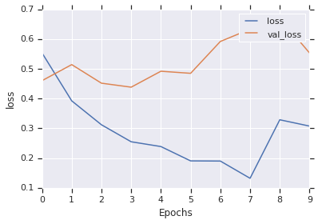
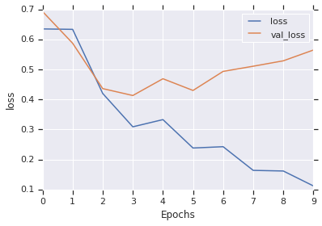

##### Copyright 2018 The TensorFlow Authors.


```
#@title Licensed under the Apache License, Version 2.0 (the "License");
# you may not use this file except in compliance with the License.
# You may obtain a copy of the License at
#
# https://www.apache.org/licenses/LICENSE-2.0
#
# Unless required by applicable law or agreed to in writing, software
# distributed under the License is distributed on an "AS IS" BASIS,
# WITHOUT WARRANTIES OR CONDITIONS OF ANY KIND, either express or implied.
# See the License for the specific language governing permissions and
# limitations under the License.
```

# Text classification with an RNN

<table class="tfo-notebook-buttons" align="left">
  <td>
    <a target="_blank" href="https://www.tensorflow.org/alpha/tutorials/text/text_classification_rnn">View on TensorFlow.org</a>
  </td>
  <td>
    <a target="_blank" href="https://colab.research.google.com/github/tensorflow/docs/blob/master/site/en/r2/tutorials/text/text_classification_rnn.ipynb">Run in Google Colab</a>
  </td>
  <td>
    <a target="_blank" href="https://github.com/tensorflow/docs/blob/master/site/en/r2/tutorials/text/text_classification_rnn.ipynb">View source on GitHub</a>
  </td>
</table>

This text classification tutorial trains a [recurrent neural network](https://developers.google.com/machine-learning/glossary/#recurrent_neural_network) on the [IMDB large movie review dataset](http://ai.stanford.edu/~amaas/data/sentiment/) for sentiment analysis.


```
from __future__ import absolute_import, division, print_function, unicode_literals

!pip install tensorflow-gpu==2.0.0-alpha0
import tensorflow_datasets as tfds
import tensorflow as tf
```

Import `matplotlib` and create a helper function to plot graphs:


```
import matplotlib.pyplot as plt


def plot_graphs(history, string):
  plt.plot(history.history[string])
  plt.plot(history.history['val_'+string])
  plt.xlabel("Epochs")
  plt.ylabel(string)
  plt.legend([string, 'val_'+string])
  plt.show()
```

## Setup input pipeline


The IMDB large movie review dataset is a *binary classification* dataset—all the reviews have either a *positive* or *negative* sentiment.

Download the dataset using [TFDS](https://www.tensorflow.org/datasets). The dataset comes with an inbuilt subword tokenizer.


```
dataset, info = tfds.load('imdb_reviews/subwords8k', with_info=True,
                          as_supervised=True)
train_dataset, test_dataset = dataset['train'], dataset['test']
```

As this is a subwords tokenizer, it can be passed any string and the tokenizer will tokenize it.


```
tokenizer = info.features['text'].encoder
```


```
print ('Vocabulary size: {}'.format(tokenizer.vocab_size))
```

    Vocabulary size: 8185


```
sample_string = 'TensorFlow is cool.'

tokenized_string = tokenizer.encode(sample_string)
print ('Tokenized string is {}'.format(tokenized_string))

original_string = tokenizer.decode(tokenized_string)
print ('The original string: {}'.format(original_string))

assert original_string == sample_string
```

    Tokenized string is [6307, 2327, 4043, 4265, 9, 2724, 7975]
    The original string: TensorFlow is cool.


The tokenizer encodes the string by breaking it into subwords if the word is not in its dictionary.


```
for ts in tokenized_string:
  print ('{} ----> {}'.format(ts, tokenizer.decode([ts])))
```

    6307 ----> Ten
    2327 ----> sor
    4043 ----> Fl
    4265 ----> ow
    9 ----> is
    2724 ----> cool
    7975 ----> .


```
BUFFER_SIZE = 10000
BATCH_SIZE = 64
```


```
train_dataset = train_dataset.shuffle(BUFFER_SIZE)
train_dataset = train_dataset.padded_batch(BATCH_SIZE, train_dataset.output_shapes)

test_dataset = test_dataset.padded_batch(BATCH_SIZE, test_dataset.output_shapes)
```

## Create the model

Build a `tf.keras.Sequential` model and start with an embedding layer. An embedding layer stores one vector per word. When called, it converts the sequences of word indices to sequences of vectors. These vectors are trainable. After training (on enough data), words with similar meanings often have similar vectors.

This index-lookup is much more efficient than the equivalent operation of passing a one-hot encoded vector through a `tf.keras.layers.Dense` layer.

A recurrent neural network (RNN) processes sequence input by iterating through the elements. RNNs pass the outputs from one timestep to their input—and then to the next.

The `tf.keras.layers.Bidirectional` wrapper can also be used with an RNN layer. This propagates the input forward and backwards through the RNN layer and then concatenates the output. This helps the RNN to learn long range dependencies.


```
model = tf.keras.Sequential([
    tf.keras.layers.Embedding(tokenizer.vocab_size, 64),
    tf.keras.layers.Bidirectional(tf.keras.layers.LSTM(64)),
    tf.keras.layers.Dense(64, activation='relu'),
    tf.keras.layers.Dense(1, activation='sigmoid')
])
```

Compile the Keras model to configure the training process:


```
model.compile(loss='binary_crossentropy',
              optimizer='adam',
              metrics=['accuracy'])
```

## Train the model


```
history = model.fit(train_dataset, epochs=10,
                    validation_data=test_dataset)
```

    Epoch 1/10
    391/391 [==============================] - 75s 191ms/step - loss: 0.5536 - accuracy: 0.7140 - val_loss: 0.0000e+00 - val_accuracy: 0.0000e+00
    Epoch 2/10
    391/391 [==============================] - 73s 187ms/step - loss: 0.3922 - accuracy: 0.8311 - val_loss: 0.5141 - val_accuracy: 0.7940
    Epoch 3/10
    391/391 [==============================] - 71s 182ms/step - loss: 0.3120 - accuracy: 0.8807 - val_loss: 0.4517 - val_accuracy: 0.8098
    Epoch 4/10
    391/391 [==============================] - 78s 199ms/step - loss: 0.2548 - accuracy: 0.9030 - val_loss: 0.4383 - val_accuracy: 0.8235
    Epoch 5/10
    391/391 [==============================] - 72s 185ms/step - loss: 0.2387 - accuracy: 0.9078 - val_loss: 0.4918 - val_accuracy: 0.8214
    Epoch 6/10
    391/391 [==============================] - 71s 182ms/step - loss: 0.1905 - accuracy: 0.9293 - val_loss: 0.4849 - val_accuracy: 0.8162
    Epoch 7/10
    391/391 [==============================] - 71s 182ms/step - loss: 0.1900 - accuracy: 0.9282 - val_loss: 0.5919 - val_accuracy: 0.8257
    Epoch 8/10
    391/391 [==============================] - 74s 190ms/step - loss: 0.1321 - accuracy: 0.9526 - val_loss: 0.6331 - val_accuracy: 0.7657
    Epoch 9/10
    391/391 [==============================] - 73s 187ms/step - loss: 0.3290 - accuracy: 0.8516 - val_loss: 0.6709 - val_accuracy: 0.6501
    Epoch 10/10
    391/391 [==============================] - 70s 180ms/step - loss: 0.3074 - accuracy: 0.8692 - val_loss: 0.5533 - val_accuracy: 0.7873


```
test_loss, test_acc = model.evaluate(test_dataset)

print('Test Loss: {}'.format(test_loss))
print('Test Accuracy: {}'.format(test_acc))
```

        391/Unknown - 19s 47ms/step - loss: 0.5533 - accuracy: 0.7873Test Loss: 0.553319326714
    Test Accuracy: 0.787320017815


The above model does not mask the padding applied to the sequences. This can lead to skewness if we train on padded sequences and test on un-padded sequences. Ideally the model would learn to ignore the padding, but as you can see below it does have a small effect on the output.

If the prediction is >= 0.5, it is positive else it is negative.


```
def pad_to_size(vec, size):
  zeros = [0] * (size - len(vec))
  vec.extend(zeros)
  return vec
```


```
def sample_predict(sentence, pad):
  tokenized_sample_pred_text = tokenizer.encode(sample_pred_text)

  if pad:
    tokenized_sample_pred_text = pad_to_size(tokenized_sample_pred_text, 64)

  predictions = model.predict(tf.expand_dims(tokenized_sample_pred_text, 0))

  return (predictions)
```


```
# predict on a sample text without padding.

sample_pred_text = ('The movie was cool. The animation and the graphics '
                    'were out of this world. I would recommend this movie.')
predictions = sample_predict(sample_pred_text, pad=False)
print (predictions)
```

    [[ 0.68914342]]


```
# predict on a sample text with padding

sample_pred_text = ('The movie was cool. The animation and the graphics '
                    'were out of this world. I would recommend this movie.')
predictions = sample_predict(sample_pred_text, pad=True)
print (predictions)
```

    [[ 0.68634349]]


```
plot_graphs(history, 'accuracy')
```


```
plot_graphs(history, 'loss')
```





## Stack two or more LSTM layers

Keras recurrent layers have two available modes that are controlled by the `return_sequences` constructor argument:

* Return either the full sequences of successive outputs for each timestep (a 3D tensor of shape `(batch_size, timesteps, output_features)`).
* Return only the last output for each input sequence (a 2D tensor of shape (batch_size, output_features)).


```
model = tf.keras.Sequential([
    tf.keras.layers.Embedding(tokenizer.vocab_size, 64),
    tf.keras.layers.Bidirectional(tf.keras.layers.LSTM(
        64, return_sequences=True)),
    tf.keras.layers.Bidirectional(tf.keras.layers.LSTM(32)),
    tf.keras.layers.Dense(64, activation='relu'),
    tf.keras.layers.Dense(1, activation='sigmoid')
])
```


```
model.compile(loss='binary_crossentropy',
              optimizer='adam',
              metrics=['accuracy'])
```


```
history = model.fit(train_dataset, epochs=10,
                    validation_data=test_dataset)
```

    Epoch 1/10
    391/391 [==============================] - 155s 397ms/step - loss: 0.6349 - accuracy: 0.6162 - val_loss: 0.0000e+00 - val_accuracy: 0.0000e+00
    Epoch 2/10
    391/391 [==============================] - 155s 396ms/step - loss: 0.6333 - accuracy: 0.6134 - val_loss: 0.5872 - val_accuracy: 0.6914
    Epoch 3/10
    391/391 [==============================] - 153s 391ms/step - loss: 0.4199 - accuracy: 0.8217 - val_loss: 0.4361 - val_accuracy: 0.8187
    Epoch 4/10
    391/391 [==============================] - 156s 398ms/step - loss: 0.3088 - accuracy: 0.8785 - val_loss: 0.4131 - val_accuracy: 0.8319
    Epoch 5/10
    391/391 [==============================] - 153s 391ms/step - loss: 0.3328 - accuracy: 0.8564 - val_loss: 0.4689 - val_accuracy: 0.7958
    Epoch 6/10
    391/391 [==============================] - 156s 398ms/step - loss: 0.2383 - accuracy: 0.9128 - val_loss: 0.4299 - val_accuracy: 0.8404
    Epoch 7/10
    391/391 [==============================] - 152s 388ms/step - loss: 0.2426 - accuracy: 0.9039 - val_loss: 0.4934 - val_accuracy: 0.8299
    Epoch 8/10
    391/391 [==============================] - 155s 396ms/step - loss: 0.1638 - accuracy: 0.9440 - val_loss: 0.5106 - val_accuracy: 0.8279
    Epoch 9/10
    391/391 [==============================] - 150s 383ms/step - loss: 0.1616 - accuracy: 0.9420 - val_loss: 0.5287 - val_accuracy: 0.8245
    Epoch 10/10
    391/391 [==============================] - 154s 394ms/step - loss: 0.1120 - accuracy: 0.9643 - val_loss: 0.5646 - val_accuracy: 0.8070


```
test_loss, test_acc = model.evaluate(test_dataset)

print('Test Loss: {}'.format(test_loss))
print('Test Accuracy: {}'.format(test_acc))
```

        391/Unknown - 45s 115ms/step - loss: 0.5646 - accuracy: 0.8070Test Loss: 0.564571284348
    Test Accuracy: 0.80703997612


```
# predict on a sample text without padding.

sample_pred_text = ('The movie was not good. The animation and the graphics '
                    'were terrible. I would not recommend this movie.')
predictions = sample_predict(sample_pred_text, pad=False)
print (predictions)
```

    [[ 0.00393916]]


```
# predict on a sample text with padding

sample_pred_text = ('The movie was not good. The animation and the graphics '
                    'were terrible. I would not recommend this movie.')
predictions = sample_predict(sample_pred_text, pad=True)
print (predictions)
```

    [[ 0.01098633]]


```
plot_graphs(history, 'accuracy')
```


```
plot_graphs(history, 'loss')
```





Check out other existing recurrent layers such as [GRU layers](https://www.tensorflow.org/api_docs/python/tf/keras/layers/GRU).
